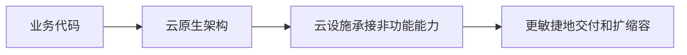

# 云原生架构：为什么不只是把程序搬到云服务器

> [!summary]- 快速复习卡片（学完再看）
> 云原生是面向云环境设计应用，让云设施承担更多弹性、韧性、安全和可观测等非功能能力。

## 把旧程序放进云服务器，为什么仍可能不好扩容

程序虽然运行在云上，但若每次扩容仍靠人工配机器、故障信息仍散在多台主机、发布仍逐台操作，它只是“部署在云上”，还没有充分利用云的分布式和弹性优势。

**直接答案是：云原生架构不是换一台云服务器，而是把应用按云的弹性、自动化和分布式特性来设计。**

教材将云原生定义为一组架构原则和设计模式的集合：尽量从云应用中剥离非业务代码，让云设施承接弹性、韧性、安全、可观测性和灰度等能力。业务代码仍负责业务价值；云平台不是替代业务设计，而是减少开发者重复处理通用运行问题。

## 七项原则先记住各自防什么

- 服务化：按不同生命周期拆分模块，用接口组织协作；
- 弹性：随业务量自动伸缩，避免固定资源长期闲置或突发不足；
- 可观测：关联分布式信息，回答故障、影响和变更后果；
- 韧性：面对故障、流量或灾难仍尽力持续服务；
- 所有过程自动化：让部署、配置、运行和变更可重复执行；
- 零信任：默认不因为“在内网”就信任人、设备或系统；
- 架构持续演进：技术和业务变化时持续评估与调整。

## 沿一笔促销订单看七项原则怎样落地

下面是**解释性教学例子**，不是教材中的真实项目：促销开始后，订单量突然上升；部分支付请求变慢；团队还要在活动期间发布一个修复版本。把七项原则放回这条链，就能看到它们各自管的对象：

| 原则 | 在这条订单链上的责任与动作 | 主要解决的问题 |
| --- | --- | --- |
| 服务化 | 订单、支付等模块通过清楚的服务接口协作；只有确有独立迭代需要时才拆成独立服务。 | 让不同生命周期的模块分别迭代，避免慢变模块拖住快变模块；不是把每个函数都拆成服务。 |
| 弹性 | 订单服务根据业务负载增加或减少运行实例，负载下降后释放多余资源。 | 高峰时不因预留不足而拒绝业务，低谷时减少闲置资源；自动伸缩依赖可观测指标和平台配置，不会自动修正错误业务逻辑。 |
| 可观测 | 给订单请求关联日志、调用链和运行度量，追踪它调用支付的耗时、结果和影响范围。 | 支付变慢时能定位是订单服务、支付依赖还是其他环节，并判断受影响用户与服务目标；只有主机监控数字而没有请求关联，仍可能解释不了整条调用链。 |
| 韧性 | 支付短暂变慢时，订单服务按边界使用超时、有限重试或降级；故障持续时隔离支付依赖，避免请求堆积拖垮订单入口。 | 依赖异常时尽力维持核心业务；重试要受次数、时限和幂等条件约束，降级也必须符合业务规则，不能把“支付成功”伪造成已确认。 |
| 所有过程自动化 | 修复版本经过构建、测试、环境配置和部署流程；工具按声明的目标状态执行，并检查健康状态。 | 让多实例、多个环境的交付可重复，减少逐台手工操作；自动化执行并不替代变更风险判断和业务验收。 |
| 零信任 | 订单服务访问支付服务或订单数据时，根据服务身份认证并按授权策略判断；不能只凭“请求来自内网”放行。 | 将访问判断建立在访问者身份、目标资源和授权上；网络位置本身不构成可信凭证。 |
| 架构持续演进 | 活动结束后检查容量、故障、成本和发布数据；若增长成为常态，再评估服务边界或部署形态，并分阶段迁移。 | 架构能随业务和技术变化调整；存量系统改造还要评估迁移成本、风险和过渡方案，不能为追求“云原生”一次性推倒重来。 |

**把责任边界记牢：**业务代码仍负责订单、支付等业务规则；云平台和自动化工具可以承接部分伸缩、运行治理与交付工作，但前提是应用提供必要的健康状态、指标、身份策略和目标配置。所谓“委托给云设施”，不等于业务方不再设计、验证或承担结果。

**做题时先定位问题对象：**模块迭代互相拖慢，看服务化；负载变化与资源不足，看弹性；请求链路原因不清，看可观测；依赖故障扩散，看韧性；多环境交付依赖手工，看自动化；访问决策只靠网络位置，看零信任；业务和技术持续变化，看持续演进。题目可能同时涉及多个原则，按题干描述的主要矛盾选切入点，不要把七个词当成互斥选项。

## 考试怎样判断

“让云设施接管弹性、韧性、可观测等非功能能力” → 云原生；“只是把单体程序迁到云主机，人工维护一切” → 不能据此判断已经云原生。下一站用[[云原生架构模式导航：面对不同问题该先看哪一种模式|模式导航]]把这些原则落到具体选择。

## 自测

1. 云原生架构把所有代码都交给云平台吗？

> [!answer]- 第 1 题答案与解析
> **答案**：不是。
> **解析**：业务代码仍实现业务价值，云设施主要承接可抽离的非功能能力。
