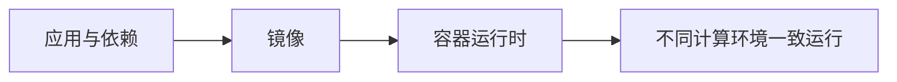

# 容器与镜像：怎样让同一个应用在不同环境一致运行

> [!summary]- 快速复习卡片（学完再看）
> 容器把应用和依赖打成标准软件单元；镜像解耦应用与运行环境，支持一致、可靠分发。

## “我电脑能跑”为什么上线后还会失败

应用可能依赖某个库、配置或系统环境；开发机有、测试或生产环境没有，就会出现同一份代码在不同环境行为不同的问题。

**直接答案是：用镜像固定应用及依赖，用容器在隔离环境运行它，让交付物在不同计算环境保持一致。**

教材将容器定位为标准化软件单元。Linux 的资源管理和 Namespace 视图隔离让应用能在独立沙箱中运行，避免相互影响；容器共享操作系统内核，因而较轻量。镜像是应用打包规范，关键价值是解耦应用与运行环境，而不是“镜像等于正在运行的容器”。

## 考试怎样判断

“应用及依赖打包、环境一致、隔离沙箱” → 容器与镜像；“在集群中选择节点、自动修复和扩缩容” → [[Kubernetes容器编排：谁来让大量容器持续处于目标状态|Kubernetes 编排]]。

## 自测

1. 镜像和运行中的容器是否是同一个东西？

> [!answer]- 第 1 题答案与解析
> **答案**：不是。
> **解析**：镜像是可分发的打包交付物，容器是据此运行的隔离实例。
