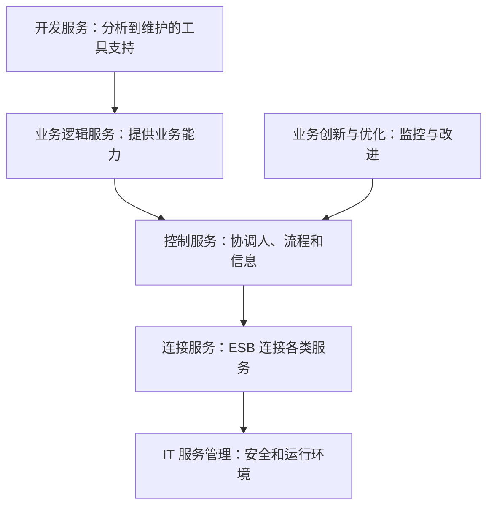

# IBM WebSphere SOA参考架构：企业集成为什么要把六类服务分开看

> [!summary]- 快速复习卡片（学完再看）
> **定位**：教材中的典型“以服务为中心”的企业集成参考架构。
> **核心方法**：关注点分离——不同服务分别承载业务能力、流程控制、连接、优化、开发和运行管理。
> **不是产品背诵题**：先按“这项能力在做什么”识别六类服务。

## 企业集成为什么不能只画一根“系统连线”

一个企业要把客户系统、订单系统、合作伙伴服务和数据库接起来，不只有“能不能调用”这一件事：还要组织业务能力、协调流程、连接异构系统、监控效果、支持开发，以及保障运行。

**教材中的 IBM WebSphere 业务集成参考架构，用六类服务把这些不同关注点分开规划。**

这不是严格的调用时序图，而是用来记住各类服务的职责边界。

## 六类服务各自回答什么问题

| 类别 | 通俗问题 | 教材定位 |
| --- | --- | --- |
| **业务逻辑服务** | 系统究竟提供什么业务能力？ | 业务应用、伙伴服务及应用/信息资产等。 |
| **控制服务** | 人、流程和信息怎样被协调？ | 实现三者集成并执行集成逻辑。 |
| **连接服务** | 分散服务怎样连起来？ | 通过 ESB 提供服务间连接性。 |
| **业务创新和优化服务** | 运行效果怎样监控并改善？ | 监控业务性能、根据变化采取改进。 |
| **开发服务** | 服务怎样从分析走到维护？ | 贯穿需求、建模、设计、开发、测试、维护的工具支持。 |
| **IT 服务管理** | 服务怎样安全、稳定地运行？ | 安全、目录、系统管理、资源虚拟化等基础设施管理能力。 |

## 用一次订单集成看分工

订单服务、库存服务和合作伙伴物流服务属于可提供的业务能力；把它们按订单流程协调起来的是控制服务；让不同系统按标准连接的是连接服务；监控订单处理指标并据此优化流程的是业务创新和优化服务；安全与运行资源保障则属于 IT 服务管理。

因此，看到“连接”不能泛答 SOA 全部内容：题干若特别说 ESB 和服务间互联，应定位连接服务；若强调流程协调，应定位控制服务。

## 参考架构不是要求每个项目照抄六个产品

这是一份教材参考架构，价值在于用关注点分离规划企业集成元素和服务组合。它不是要求每个小系统都部署六套独立产品，也不表示每项服务只能存在于一个物理进程中。考试中优先根据职责归类，而不是根据厂商名称猜产品功能。

## 考试怎样判断

- “关注点分离、以服务为中心的企业集成、六类服务” → IBM WebSphere SOA 参考架构；
- “连接、ESB、服务间互联” → 连接服务；
- “人/流程/信息集成” → 控制服务；
- “安全、目录、系统管理、资源虚拟化” → IT 服务管理。

## 自测

1. 在该参考架构中，负责通过 ESB 提供服务间连接性的是什么？

> [!answer]- 第 1 题答案与解析
> **答案**：连接服务。
> **解析**：教材将服务间连接性归入连接服务，并以 ESB 承担这一位置。

2. 运行指标监控后用于改进业务流程，属于哪类服务？

> [!answer]- 第 2 题答案与解析
> **答案**：业务创新和优化服务。
> **解析**：它关注运行时业务性能和变化，并推动优化。
