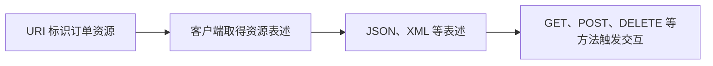

# REST：怎样把服务接口设计成围绕资源的交互

> [!summary]- 快速复习卡片（学完再看）
> **REST**：以资源为中心的架构设计思想，资源通过 URI 标识，客户端与服务端交换资源的表述。
> **资源**：订单、图片等可被客户端访问的事物。
> **动作**：借助 GET、POST、DELETE 等 HTTP 方法发生状态转移。

## 为什么接口不应只剩一堆随意的动作名

订单服务若把接口设计成“处理订单一”“处理订单二”，调用方很难知道各接口面对的对象和含义。REST 先把订单看成资源，再围绕资源提供访问和操作。

教材说明 REST 是一种软件架构风格；资源可由 URI 标识，资源的表述可以是 HTML、JSON、XML 或纯文本。一个资源可以设计多个 URI，但一个 URI 对应一种资源。

## 状态转移到底在说什么

教材区分应用状态与资源状态：应用状态与用户请求会话相关，由客户端维护；资源状态保存在服务端，是资源某时刻的快照。客户端借助 HTTP 方法与资源表述交互，从而完成状态转移。

## 跟着一次订单查询和修改看两类状态

下面是**解释性教学例子**，不是某个真实 API 的规范。浏览器客户端要查看并取消订单 `42`：

1. 客户端请求 `GET /orders/42`，服务端读取订单资源，返回例如 JSON 形式的当前表述：订单状态为“待支付”，并可在表述中提供允许的后续资源链接。
2. 客户端据此显示订单，并保存自己当前界面/交互所需的会话信息，例如用户正在查看订单 `42`。这类“客户端下一步在做什么”的应用状态由客户端维护；REST 的无状态约束要求每个请求携带处理它所需的上下文，服务端不依赖保存前一次请求的会话状态才能理解后续请求。
3. 用户选择取消时，客户端按资源接口发起相应请求（例如调用取消操作，或在接口契约允许时通过 `DELETE` 交互）。服务端根据资源当前状态和业务规则判断是否允许，再更新自己保存的订单资源状态并返回结果。
4. 下次请求读取订单时，客户端取得服务端当前的资源表述。若订单已成功取消，后续表述反映该资源状态变化；资源状态并不会因为客户端保存了页面状态而自动改变。

因此两类状态不要混淆：**应用状态**描述客户端在交互/导航过程中的当前进展；**资源状态**是服务端所维护的订单等业务资源状态。REST 的“状态转移”是客户端通过资源表述和 HTTP 方法参与交互，促使服务端资源状态按规则变化；它不是“把所有状态都放在客户端”，也不是只给 URL 套上 GET/POST 就自然满足 REST 约束。

这不等于“只要用 HTTP 就是 REST”。题干应同时体现资源中心、URI、资源表述与满足 REST 约束的设计思想，才称 RESTful。

## REST 和 SOAP 不要混

- REST 关注围绕资源的接口与表述交互；
- SOAP 关注 Web 服务消息规范；
- WSDL 是服务说明书；UDDI 是服务发现目录。

## 考试怎样判断

“资源、URI、表述、GET/POST/DELETE、RESTful” → REST；“操作、协议、地址说明” → WSDL；“消息封装” → SOAP。

## 自测

1. `/orders/42` 表示一个订单，返回 JSON 后使用 DELETE 删除它，主要体现什么？

> [!answer]- 第 1 题答案与解析
> **答案**：REST 的资源与状态转移思想。
> **解析**：订单是资源，URI 标识资源，HTTP 方法参与资源交互。

2. 浏览器记得用户当前打开的是订单 42，而服务端保存订单 42 当前为“待支付”，这两种状态分别属于哪一类？

> [!answer]- 第 2 题答案与解析
> **答案**：浏览器的交互进展属于应用状态；服务端维护的“待支付”属于资源状态。
> **解析**：REST 不要求把业务资源状态搬到客户端；服务端仍按业务规则保存和改变资源状态。

3. 只使用 HTTP 方法和 JSON，是否足以判定一个接口是 RESTful？

> [!answer]- 第 3 题答案与解析
> **答案**：不足以。
> **解析**：还需围绕资源组织接口，并遵循 REST 设计约束；HTTP/JSON 只是技术形式。
