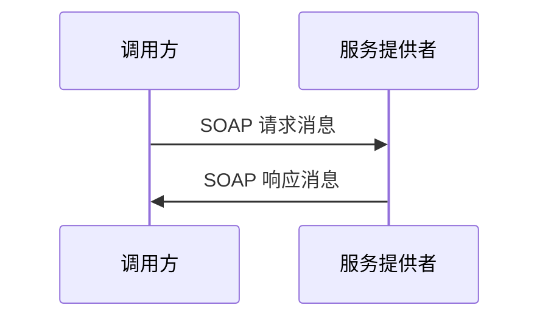

# SOAP消息交换：服务调用时请求和响应怎样按约定传递

> [!summary]- 快速复习卡片（学完再看）
> **SOAP**：用于 Web 服务消息交换的规范，强调简单性和可扩展性。
> **不要混淆**：SOAP 是消息交换规范；WSDL 是接口说明；UDDI 是服务发现目录。

## 服务两端为什么要按同一种“信封”传消息

两个系统可能用不同语言实现。若请求和响应没有共同格式，双方就很难可靠解析对方传来的内容。

**SOAP 提供的是 Web 服务消息交换的约定，而不是业务功能本身。**教材说明它的主要设计目标是简单性和可扩展性。



SOAP 不负责告诉你“服务有哪些操作和地址”——那是 WSDL；也不负责替你找到服务——那是 UDDI。题干问消息封装、请求/响应交换、简单和可扩展时，才定位 SOAP。

## 一条查订单消息怎样装进 SOAP 信封

假设订单客户端要查询订单 `A102`。下面是结构示意，省略命名空间等 XML 细节：

```xml
<Envelope>
  <Header>
    <!-- 可选扩展信息：例如身份凭据、追踪标识或路由约定 -->
  </Header>
  <Body>
    <GetOrderRequest>
      <orderId>A102</orderId>
    </GetOrderRequest>
  </Body>
</Envelope>
```

- **Envelope（信封）**标明这是 SOAP 消息，并包住可选头部和消息主体。
- **Header（头）**承载扩展控制信息；具体模块和处理规则由相应规范/双方约定决定，不是每条消息都必须有业务头。
- **Body（体）**承载本次业务请求。服务端处理后，通常以同样的 SOAP 消息结构返回 `GetOrderResponse`；若调用失败，可按所用 SOAP 版本和约定返回 Fault。

先看消息封装就定位 SOAP；操作名称与数据结构的接口描述看 WSDL，服务发现看 UDDI。SOAP 信封只规定消息结构，不保证请求一定成功或替代业务错误处理。

## 自测

1. Web 服务间按统一消息规范传递请求和响应，且强调简单、可扩展，是什么？

> [!answer]- 第 1 题答案与解析
> **答案**：SOAP。
> **解析**：SOAP 是 Web 服务的消息交换规范，不是服务目录或接口说明。
