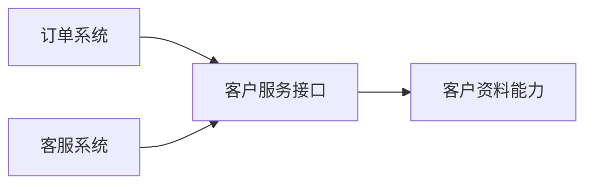

# SOA：怎样把跨系统能力组织成可组合的服务

> [!summary]- 快速复习卡片（学完再看）
> **SOA**：把系统拆为多个可通过接口调用的服务，用服务组合支撑跨系统业务。
> **直接价值**：让不同语言、平台或历史系统中的能力能以较松的依赖方式协作和复用。
> **题眼**：服务、接口、松耦合、企业集成、ESB。

## 多个系统都有“查客户”，为什么不应各写一遍

订单、客服和积分系统都需要查客户资料。若各自复制规则，资料格式和校验要求很快不一致。SOA 的做法是把“查客户”作为一项服务能力，通过约定的接口供多个系统使用。

**SOA 的直接答案是：以服务为组织单元，让调用者依赖服务接口，而不是绑死某个系统内部实现。**

教材将 SOA 描述为面向服务的组件模型：系统被拆成独立功能模块，模块经接口交互，从而整合业务功能并保持较松的耦合。

## SOA 为什么会出现

教材的背景是：互联网环境中出现大量用不同平台和语言开发的 Web 服务组件，需要一种架构让不同组织提供的服务能够交互，同时兼顾安全、复用与可管理性。

发展脉络可记为：XML 先让数据有统一描述和交换基础；SOAP、WSDL、UDDI 等 Web 服务规范推动互操作；随后关注点从“单个 Web 服务”扩展到安全、业务流程和事务等完整的服务架构问题。

不必把年份当作核心考点；关键是理解 SOA 要解决的是**跨系统能力组织与协作**，而不是把每个函数都改名叫“服务”。

## ESB 在教材语境中的位置

教材以企业服务总线（ESB）连接 SOA 的各子系统。可以把它理解为企业集成中的连接与中介位置：服务请求者通过标准方式访问服务，连接层可承担传递、路由、转换等工作，从而减少请求者对提供者位置和实现细节的依赖。

ESB 不是“所有业务规则都放进去”的地方；业务能力仍属于各服务，ESB 主要解决服务之间怎样连接和协调。它的具体机制将在后续 ESB Atom 展开。

## SOA 和微服务不能直接画等号

教材把微服务看作 SOA 思想的一种扩展，强调服务个体更独立、粒度更小和去中心化部署；同时以 SOA+ESB 作为一种集中式企业集成语境。

因此，看到“服务”不必立刻选微服务：若题干强调企业服务总线、跨系统集成、标准服务连接，优先考虑 SOA；若强调服务独立部署、细粒度和去中心化，再考虑微服务。详细比较留到云原生主事实源，避免在本卡重复展开。

## 考试怎样判断

- 跨系统业务能力通过稳定接口复用、松耦合集成 → SOA；
- 多个已有 Web 服务按业务流程组合成一个对外服务 → [[BPEL服务编排：怎样把多个服务排成一条业务流程|BPEL 编排]]；
- 连接、路由、转换并降低请求者和提供者耦合 → ESB 语境。

## 自测

1. 多个异构系统通过约定接口调用同一项业务能力，主要体现什么架构思想？

> [!answer]- 第 1 题答案与解析
> **答案**：SOA。
> **解析**：SOA 以服务和接口组织跨系统能力，使调用方不依赖具体实现。

2. ESB 的核心定位是直接承载全部业务规则吗？

> [!answer]- 第 2 题答案与解析
> **答案**：不是。
> **解析**：它主要提供服务之间的标准连接与中介能力，业务能力仍由服务承担。
