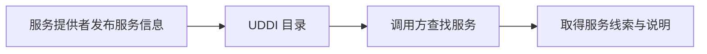

# UDDI服务发现：调用方怎样知道哪里有可用服务

> [!summary]- 快速复习卡片（学完再看）
> **UDDI**：帮助发布和查找服务的信息目录。
> **直接问题**：调用方怎样知道有哪些服务可用，以及到哪里取得服务说明？

## 调用服务前，先要知道“去哪里找”

订单系统想调用物流服务，第一步不是猜 URL，而是确认有没有可用服务、服务由谁提供以及怎样取得它的接口信息。

UDDI 是 Universal Description, Discovery and Integration 的缩写。教材把它列为 Web 服务标准化阶段的服务发现与集成规范。学习时先把它看成“服务目录”：服务提供者登记信息，调用方据此发现服务。

UDDI 不负责详细写出接口操作、消息格式或传输协议；这些信息由[[WSDL服务描述：调用方怎样读懂服务说明书|WSDL]]描述，实际消息交换再由[[SOAP消息交换：服务调用时请求和响应怎样按约定传递|SOAP]]等规范承担。

## 考试怎样判断

- “注册、目录、发现服务” → UDDI；
- “操作、数据格式、协议、URL/端点” → WSDL；
- “XML 消息、请求/响应封装、简单可扩展” → SOAP。

## 自测

1. 调用方要查找可用的物流服务，最先应想到哪类规范？

> [!answer]- 第 1 题答案与解析
> **答案**：UDDI。
> **解析**：UDDI 的定位是服务发布与发现。

2. UDDI 负责把业务规则写进消息吗？

> [!answer]- 第 2 题答案与解析
> **答案**：不负责。
> **解析**：UDDI 的定位是服务发现；消息交换由 SOAP 等协议承担。
