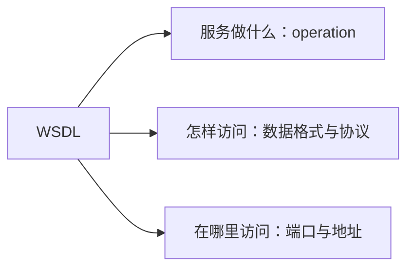

# WSDL服务描述：调用方怎样读懂服务说明书

> [!summary]- 快速复习卡片（学完再看）
> **WSDL**：用 XML 描述 Web 服务以及怎样和它通信的语言。
> **三问**：服务做什么？怎样访问？服务在哪里？

## 不看说明书，调用方怎么会知道请求该怎么写

调用订单查询服务前，调用方需要知道可调用的操作、请求和响应数据格式、使用的协议以及访问地址。

**WSDL 就是这份服务说明书。**教材将它定义为 Web 服务接口定义语言，描述操作、交互数据格式与协议、以及协议相关的地址。

文档中的 types、message、operation、portType、binding、port、service 等结构不必一次全背；做题先稳住三问。WSDL 描述契约，不直接承担服务发现或消息传递。

## 把“查订单”请求映射到服务说明书

下面是**解释性简化例子**，用于看懂 WSDL 各部分的分工，不是教材原文或完整可部署的 WSDL 文件。假设订单服务提供 `GetOrder` 操作：调用方提交订单编号，服务返回订单状态。

| 调用方要确认的内容 | 在这个例子里的描述 | WSDL 中常见对应元素 |
| --- | --- | --- |
| 请求和响应有哪些字段、类型是什么？ | 请求含 `orderId`；响应含 `status`。 | `types` 定义类型；`message` 描述请求/响应消息结构。 |
| 能调用什么操作？ | 有一个 `GetOrder`，接收请求消息并返回响应消息。 | `operation` 描述操作及消息对；`portType` 聚合一组抽象操作。 |
| 用什么具体格式和协议交互？ | 例如把抽象操作绑定到一种约定的数据格式和传输协议。 | `binding` 把抽象接口映射到具体格式/协议。 |
| 调用地址在哪里？ | 例如订单服务某个环境的访问 URL。 | `port` 把具体绑定与网络地址组合成访问点；`service` 聚合相关访问点。 |

实际阅读时，先从 `service/port` 找访问地址和绑定，再沿 `binding → portType → operation → message/types` 看调用细节；定义也可能被拆到导入的 WSDL 或 XML Schema 文件中。重点是理解**抽象操作和消息**如何落到**具体协议与地址**，而不是死记孤立标签。服务目录（如 UDDI）负责发布/查找服务；SOAP 等协议负责消息交换，不能与 WSDL 的描述职责混为一谈。

## 考试怎样判断

- 操作/方法、消息格式、协议、端点地址 → WSDL；
- 发布和查找服务 → [[UDDI服务发现：调用方怎样知道哪里有可用服务|UDDI]]；
- 消息怎样封装交换 → [[SOAP消息交换：服务调用时请求和响应怎样按约定传递|SOAP]]。

## 自测

1. “服务提供哪些操作、用什么协议和 URL 调用”属于什么？

> [!answer]- 第 1 题答案与解析
> **答案**：WSDL。
> **解析**：它描述服务做什么、怎样访问和位于何处。

2. `GetOrder` 请求有哪些字段属于哪部分描述？把服务绑定到 HTTP/SOAP 约定又属于哪部分？

> [!answer]- 第 2 题答案与解析
> **答案**：请求/响应字段由 `types`、`message` 等描述；协议和格式绑定由 `binding` 描述。
> **解析**：`operation` 表示抽象操作，`portType` 聚合操作，`port` 再把具体绑定与访问地址组合起来。

3. WSDL 中的 `port` 主要把哪两类信息放在一起？

> [!answer]- 第 3 题答案与解析
> **答案**：协议/数据格式绑定与具体 Web 访问地址。
> **解析**：操作和数据契约本身不等于部署地址；`port` 提供访问点。
