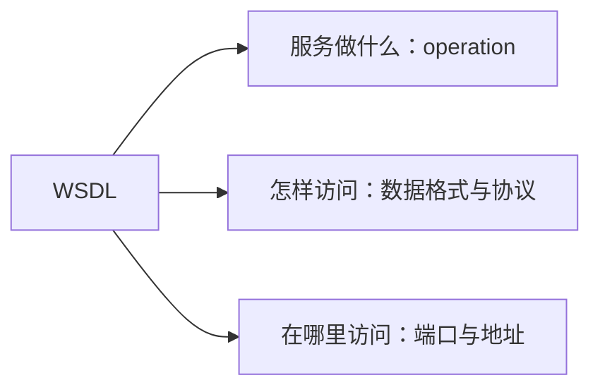

# WSDL服务描述：调用方怎样读懂服务说明书

> [!summary]- 快速复习卡片（学完再看）
> **WSDL**：用 XML 描述 Web 服务以及怎样和它通信的语言。
> **三问**：服务做什么？怎样访问？服务在哪里？

## 不看说明书，调用方怎么会知道请求该怎么写

调用订单查询服务前，调用方需要知道可调用的操作、请求和响应数据格式、使用的协议以及访问地址。

**WSDL 就是这份服务说明书。**教材将它定义为 Web 服务接口定义语言，描述操作、交互数据格式与协议、以及协议相关的地址。

文档中的 types、message、operation、portType、binding、port、service 等结构不必一次全背；做题先稳住三问。WSDL 描述契约，不直接承担服务发现或消息传递。

## 考试怎样判断

- 操作/方法、消息格式、协议、端点地址 → WSDL；
- 发布和查找服务 → [[UDDI服务发现：调用方怎样知道哪里有可用服务|UDDI]]；
- 消息怎样封装交换 → [[SOAP消息交换：服务调用时请求和响应怎样按约定传递|SOAP]]。

## 自测

1. “服务提供哪些操作、用什么协议和 URL 调用”属于什么？

> [!answer]- 第 1 题答案与解析
> **答案**：WSDL。
> **解析**：它描述服务做什么、怎样访问和位于何处。
