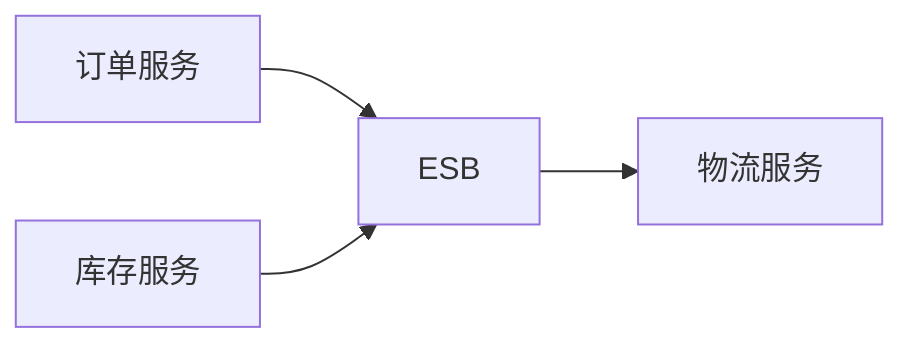

# 企业服务总线ESB：为什么不让系统两两直连

> [!summary]- 快速复习卡片
> ESB 是支持 SOA 的中间件基础平台，让异构服务按消息和事件方式交互，降低点对点集成复杂度。

## 系统两两直连为什么会越连越乱

每加一个系统就新增多条接口，路由、格式转换和协议适配会散落在各处，造成复杂、难管理和脆弱。

**ESB 的直接答案是：提供统一的总线式连接平台，让服务通过标准消息交互。**

教材列出的核心能力包括位置透明的路由和寻址、服务注册命名、多种消息模式与协议、数据格式转换、日志和监控。ESB 是架构模式，不能简单等同某个产品。

## 一条异构订单怎样经总线到达物流

下面是**解释性教学例子**，不是教材中的真实系统。订单服务发出一条 JSON/HTTP 形式的发货请求，而旧物流系统只接受 XML 消息和另一种既定传输协议。若两边直接对接，订单服务就得了解物流地址、格式和协议；以后再接第二家物流，类似适配逻辑又会复制一遍。

经 ESB 时可以按这条链理解：

1. 订单服务按约定把请求发给总线，消息中带有目标服务名或接口名，而不是硬编码物流机器位置。
2. ESB 按服务名查找目标，选择已登记的物流端点；需要时把统一请求格式转换为物流系统接受的格式，并使用双方可用的传输协议转发。
3. 物流系统返回处理结果后，ESB 按约定将结果送回请求方；总线可记录调用日志和监控信息，帮助定位路由或交互失败。

此处的“位置透明”是调用方无需自行维护目标机器地址，不代表地址、协议或格式差异凭空消失；它们由总线的路由、转换和连接配置承担。ESB 也不应替订单服务决定“是否允许发货”等业务规则。它降低点对点连接复杂度，但总线本身成为重要共享基础设施，路由/转换配置和故障影响仍需治理。

## 考试怎样判断

“点对点复杂、路由、协议/格式转换、消息事件驱动、异构集成” → ESB；它不替代业务服务本身。

## 自测

1. ESB 解决的主要问题是什么？

> [!answer]- 答案
> 用总线式标准连接降低异构系统点对点集成的复杂度。

2. 订单系统无需知道物流系统地址，并且请求在转发前被转换为物流可接收的格式，分别体现 ESB 的什么能力？

> [!answer]- 第 2 题答案与解析
> **答案**：位置透明的路由/寻址，以及数据格式转换。
> **解析**：ESB 根据目标服务名找到端点，并在配置需要时做协议或格式适配；业务规则仍由业务服务负责。
