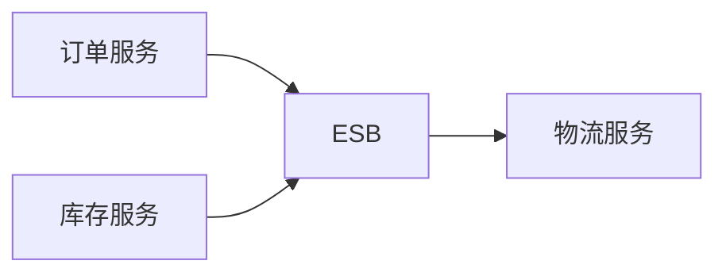

# 企业服务总线ESB：为什么不让系统两两直连

> [!summary]- 快速复习卡片
> ESB 是支持 SOA 的中间件基础平台，让异构服务按消息和事件方式交互，降低点对点集成复杂度。

## 系统两两直连为什么会越连越乱

每加一个系统就新增多条接口，路由、格式转换和协议适配会散落在各处，造成复杂、难管理和脆弱。

**ESB 的直接答案是：提供统一的总线式连接平台，让服务通过标准消息交互。**

教材列出的核心能力包括位置透明的路由和寻址、服务注册命名、多种消息模式与协议、数据格式转换、日志和监控。ESB 是架构模式，不能简单等同某个产品。

## 考试怎样判断

“点对点复杂、路由、协议/格式转换、消息事件驱动、异构集成” → ESB；它不替代业务服务本身。

## 自测

1. ESB 解决的主要问题是什么？

> [!answer]- 答案
> 用总线式标准连接降低异构系统点对点集成的复杂度。
