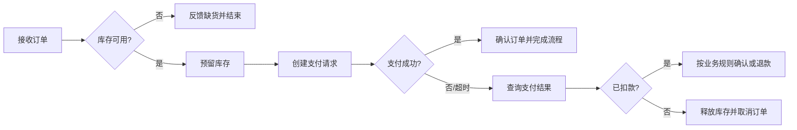

# 建立业务流程：怎样把活动、决策和异常变成可执行模型

> [!summary]- 快速复习卡片（学完再看）
> 业务流程是为提供业务价值而规定的活动顺序，必须同时建模正常路径、决策条件和异常。

## 有了服务，为什么仍要画流程

服务说明“能做什么”，但一次下单还要说明先校验库存还是先扣款、失败后走哪里、输入和输出是什么。缺少这些关系，分析员和开发人员会各自理解出不同流程。

**直接答案是：把业务活动、决策、输入输出、规则和异常组织成流程模型，让业务需求能够一致地交给实现。**

教材把流程定义为带有明确输入和输出、用于提供业务价值的活动顺序。建模时先把流程拆为子流程，再识别每个子流程的组件、服务、输入输出数据、策略和度量；步骤由控制流连接，决策点根据业务规则决定路线。除正常操作外，也必须捕获异常和其他标准操作。

业务对象是流程处理的数据对象：实体对象对应客户、订单等名词；过程对象对应处理任务等动词；事件对象对应系统操作产生的事件。它们帮助流程中的数据和动作有明确所指。

## 支付失败时，流程怎样收尾

继续看图中的“先预留库存，再请求支付”。**这是解释性流程例子，不是统一交易方案。**若支付明确失败，流程取消待确认订单并释放预留库存，避免库存一直占住；若支付请求超时，则不能直接假定“未扣款”，而要查询支付结果或按约定核对。查明已扣款时，按业务规则确认订单或退款；查明未扣款时，才释放库存并取消订单。

把这条异常分支建模完整，至少要能读出：触发条件（支付失败或超时）、分支判断（实际是否扣款）、每条分支执行的活动（确认/退款，或释放库存/取消订单）和流程终态。退款与释放库存属于对已完成动作的补救/补偿，执行失败时还应记录待处理状态并安排重试或人工处理；流程模型若只画“支付失败→结束”，会留下资金与库存状态不明的悬空结果。实际系统还必须定义支付幂等标识、超时查询和补偿规则，不能仅靠画出箭头自动保证事务一致。

## 考试怎样判断

“活动顺序、输入输出、控制流、决策条件、异常” → 业务流程建模；“把多个已有 Web 服务编排成一个复合服务” → [[BPEL服务编排：怎样把多个服务排成一条业务流程|BPEL 服务编排]]。前者先说明业务流程，后者是服务编排的一种实现语境。

## 自测

1. 业务流程模型只保留正常路径、不记录异常，是否完整？

> [!answer]- 第 1 题答案与解析
> **答案**：不完整。
> **解析**：教材要求流程建模同时获取正常操作以外的操作和异常。
