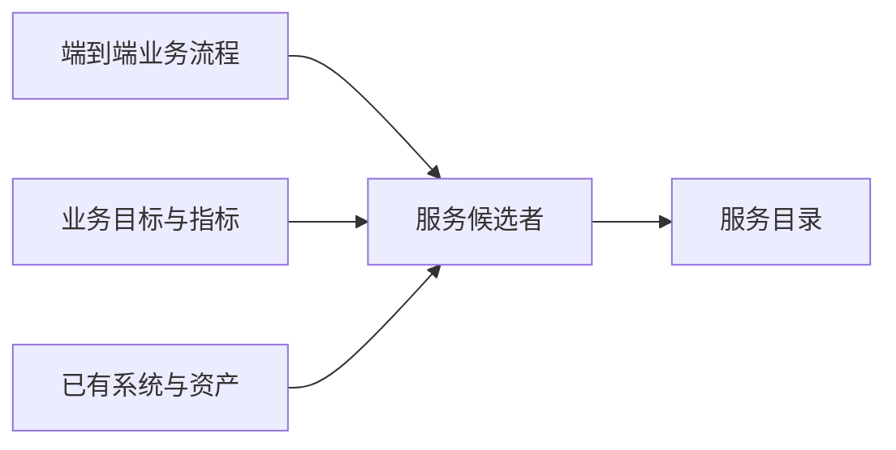

# 建立服务模型：怎样从业务目标、流程和遗留资产找到服务

> [!summary]- 快速复习卡片（学完再看）
> 服务模型不是凭功能菜单命名；从业务流程、业务目标和已有资产发现候选服务，再形成服务目录。

## 服务应该从哪里找

若只把旧系统的每个接口原样搬出来，可能重复了已有能力，也看不出服务该为哪个业务目标负责。服务建模先回答“业务真正需要哪些可组合能力”。

**直接答案是：从业务自顶向下分解、从目标验证遗漏、再从遗留资产自底向上复用，汇总出服务候选者。**

教材的三种方法分工如下：自顶向下把端到端流程逐层拆为有业务含义的活动，每个活动可成为候选者；业务目标分析把目标拆成子目标，再检查哪些服务承接目标；自底向上分析遗留系统的功能模块，找出可复用或重复实现的能力。候选服务还要划分到业务组件中，最终形成层次化服务目录。

变化分析也不能漏：把易变业务逻辑和稳定部分分开，新的需求可能带来新的候选服务。

## 考试怎样判断

“从端到端流程逐层分解” → 自顶向下；“从 KPI 或业务目标回溯服务” → 目标服务建模；“盘点旧系统可复用模块” → 自底向上遗留资产分析。

下一步不是急着写接口，而是把业务对象、接口粒度和活动顺序组织成[[建立业务流程：怎样把活动、决策和异常变成可执行模型|业务流程模型]]。

## 自测

1. 从既有系统功能目录中找可复用模块并包装为服务，属于哪种分析方法？

> [!answer]- 第 1 题答案与解析
> **答案**：自底向上遗留资产分析。
> **解析**：它以已有资产为起点，不是从端到端流程向下拆分。
