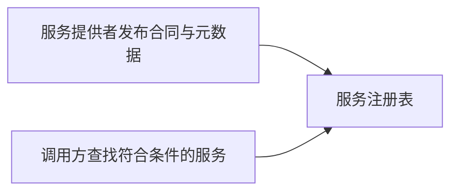

# 服务注册表模式：怎样集中管理服务合同、策略和元数据

> [!summary]- 快速复习卡片
> 服务注册表是集中发布、管理和检索服务合同、策略与元数据的位置，也是 SOA 治理的控制点。

## 服务多起来后，不能只靠口头问“谁能提供”

服务合同、位置、方法、绑定和策略若散在各团队手里，调用方很难发现并确认可用服务。

**注册表的直接答案是：把服务合同、策略和元数据集中登记、发布、管理和检索。**

教材说明它主要用于 SOA 设计期，也可有运行期功能；UDDI 是一种主要注册环境，但不是唯一选择。它不只是“地址簿”，还是治理中限制谁能发布、由谁批准、按什么条件批准的控制点。

## 考试怎样判断

题干出现“集中管理服务合同、策略和元数据”“发布审批”“发现可调用服务”，优先判断为**服务注册表模式**。UDDI 是注册环境的例子，不能把“注册表”狭义等同为 UDDI。

## 自测

1. 集中管理服务合同、策略和元数据的模式是什么？

> [!answer]- 答案
> 服务注册表模式。
