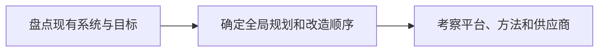

# 选择SOA解决方案：先评估全局规划，再选平台和实施路径

> [!summary]- 快速复习卡片（学完再看）
> 选择 SOA 不是先买产品：先做企业全局评估，再看需求、平台开放标准、实施路径和供应商能力。

## 为什么不能看到 ESB 就直接采购

一家企业可能有大量遗留系统，也可能只有少量待连接应用；预算、已有 IT 资产和改造顺序都不同。先定产品再找场景，常会把局部工具误当成企业方案。

**直接答案是：选择 SOA 解决方案要先做全局规划和现状评估，再按企业需求选择平台、实施方法与供应商。**

教材给出三类选择关注点：尽量选能全局规划的方案；充分考虑企业自身需求；从平台、实施和供应商等技术方面考察。评估时要问已有系统哪些可用、哪些需要改造、未来需求和可投入资本；实施还要明确先改哪个系统、按什么步骤进行。

## 用三步做方案第一判断

- 平台：优先看开放性和对标准的支持；
- 实施：同时考虑业务战略与流程、基础架构、构建模块、项目应用、成本效益、规划管理；
- 供应商：产品要符合实际需求，还要考察案例、客户评价和专业服务能力。

这是一套选型判断，不等于保证某产品一定适合；最终仍要回到企业需求和已有投资。

## 自测

1. SOA 选型的第一步是比较某产品功能列表吗？

> [!answer]- 第 1 题答案与解析
> **答案**：不是。
> **解析**：先评估企业现状、目标和整体规划，再决定平台与实施路径。
