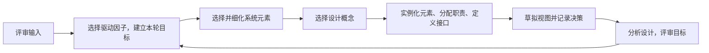

# ADD 属性驱动设计：怎样按质量场景一轮轮细化嵌入式架构

一套控制设备既要完成采集功能，又要在限定时间内响应，还要方便后续扩展。若先随意画出模块图，再补“性能、可靠性”，往往会发现结构已经很难调整。

**直接答案是：ADD（属性驱动设计）用质量属性、主要功能、约束和架构关注点作为驱动因子，通过多轮迭代不断细化架构元素。** 它的关键不是一次选定所有模块，而是每轮优先解决一个明确的架构目标。

教材给出的驱动因子包括设计目的、主要功能需求、质量属性场景、约束条件和架构关注点。对控制设备而言，“采集数据”是功能；“告警在规定时间内响应”是质量属性场景；“只能使用有限内存”是约束。它们一起决定该先细化什么。

可把七步压缩理解为三件连续的事：先确认输入和本轮要满足的驱动因子；再挑选元素与设计概念，把职责和接口落到具体架构元素；最后记录视图、分析和评审，再决定是否进入下一轮。教材特别强调迭代：优先保证高优先级驱动因子，资源有限时不可能让每个因素都在同一轮达到同样深度。

ADD 不等于“只看性能”。这里的“属性驱动”指质量属性与其他架构驱动因素共同带动设计；它也不替代需求分析或后续实现。题干若给出“质量属性场景、选择驱动因子、架构元素细化、记录视图、迭代评审”，优先识别 ADD。

## 把“告警要及时”变成一次架构决策

下面是**解释性教学例子**，其中时间和内存数值是为演示步骤设定的假设，不是教材指标或通用合格线。某温控器要求温度传感器发现过热后及时告警，同时控制软件只能使用有限内存。

先把性能要求写成可验证的质量场景：传感器（刺激源）在正常运行时报告过热（刺激）；告警任务是受影响制品；系统应触发蜂鸣器并记录事件（响应）；从采样到告警不超过 50 ms（响应度量）。再记录约束：可用运行内存上限假设为 64 KB。这样“要快、内存有限”从口号变成了设计输入。

本轮选择“最坏情况下告警延迟不超过 50 ms”为主要驱动因子。设计团队把职责细化为采样、温控判断和告警输出三个元素，采用可抢占的实时调度概念，让告警任务能优先打断非关键通信任务；为减少动态分配带来的不可预测性，评估固定大小缓冲区。接着为三项元素定义数据接口与优先级，再列出各部分最坏响应时间预算，并在目标负载下测量/分析总响应是否不超过 50 ms，同时检查内存是否越过假设的 64 KB 上限。

如果分析发现告警路径的最坏时间超过目标，本轮就调整任务优先级、减少路径工作或重新划分职责，再次评估；如果时间满足但内存超限，则继续在下一轮处理内存驱动因子。**这就是 ADD 的迭代**：用场景和约束选定当前目标，挑选架构元素与设计概念，落实职责/接口，分析结果，再决定下一轮。使用可抢占调度和固定缓冲区只是此例的候选设计概念，不是所有嵌入式系统的唯一正确答案。

> [!summary]- 快速复习卡片（学完再看）
> **驱动输入**：功能、质量场景、约束、关注点与设计目的。
> **主线**：选驱动因子 → 细化元素/概念 → 定职责接口 → 记录评审 → 迭代。
> **易错点**：ADD 是迭代细化，不是先画一次最终架构。

当系统的核心难题变成多个并发任务和严格时间约束时，需要进一步使用面向实时系统的 DARTS 方法。

## 自测

1. ADD 中“本轮设计先要解决什么”主要由什么确定？

> [!answer]- 第 1 题答案与解析
> **答案**：由选择的架构驱动因子及其迭代目标确定。
> **解析**：驱动因子可来自质量属性场景、功能、约束和架构关注点等。

2. 在上述温控器示例中，“从过热采样到告警不超过 50 ms”属于什么输入？“只能用 64 KB 内存”又属于什么？

> [!answer]- 第 2 题答案与解析
> **答案**：前者是质量属性场景中的响应度量；后者是架构约束。
> **解析**：ADD 先把不同驱动因子分清，再选定本轮设计目标，不能把它们混成一句“系统要可靠又快”。
