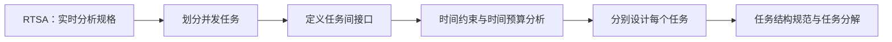

# DARTS 实时系统设计：怎样把实时需求分解成可协作的并发任务

工业控制设备要同时采集输入、计算控制策略、驱动执行器和处理告警。它们既能并发发生，又各自受时间约束；只按普通模块拆分，可能说不清任务间什么时候通信、怎样同步。

**直接答案是：DARTS 是面向实时系统的设计方法，它把系统分解为多个并发任务，定义任务间接口，并把实时分析规格转换为可设计的任务结构。**

教材说明，DARTS 建立在实时结构化分析/设计的基础上，专门补足“实时系统由并发任务组成”这一点。任务接口可表现为消息通信、事件同步或信息隐藏模块（IHM）：有数据要传可用消息；没有数据但要等对方完成可用事件；共享数据则通过 IHM 封装，并在多任务访问时进行同步。

五个主要步骤可这样走：先用 RTSA 开发系统规范；再从数据流/控制流中划分并发任务；把数据流、事件流和数据存储分别映射为消息、事件和 IHM 等任务接口；为外部事件到系统响应的任务链分配时间预算；最后把每个任务继续设计成顺序程序的模块。

例如温控系统可拆成周期采样任务、控制计算任务和告警任务。采样结果以消息交给控制任务；告警到达以事件唤醒处理任务；共享配置由 IHM 管理。若要求传感器变化后 50 ms 内完成控制，就要把这条任务链的时间预算分别分配给采样、通信、计算和输出，而不是最后才测总耗时。

教材也给出边界：DARTS 对前期 RTSA 规格质量依赖很强；若分析阶段没有做好，后续创建任务会很困难。题干出现“并发任务、任务架构图、RTSA、任务间消息/事件/IHM、时间预算”，优先判断 DARTS。

> [!summary]- 快速复习卡片（学完再看）
> **核心**：把实时系统拆成并发任务，并定义接口和时间约束。
> **接口映射**：数据流 → 消息；事件流 → 事件；共享数据 → IHM。
> **易错点**：DARTS 的任务分解依赖前期 RTSA 规格质量。

本章的所有 Atom 至此都有主事实源或合法复用落点，下一步只做一次章节联合验收。

## 自测

1. DARTS 中多个任务需要访问共享数据，教材建议通过什么形式管理该数据？

> [!answer]- 第 1 题答案与解析
> **答案**：信息隐藏模块（IHM），并对多任务访问进行同步。
> **解析**：IHM 用于封装数据存储；它不同于用消息传递独立数据流。
