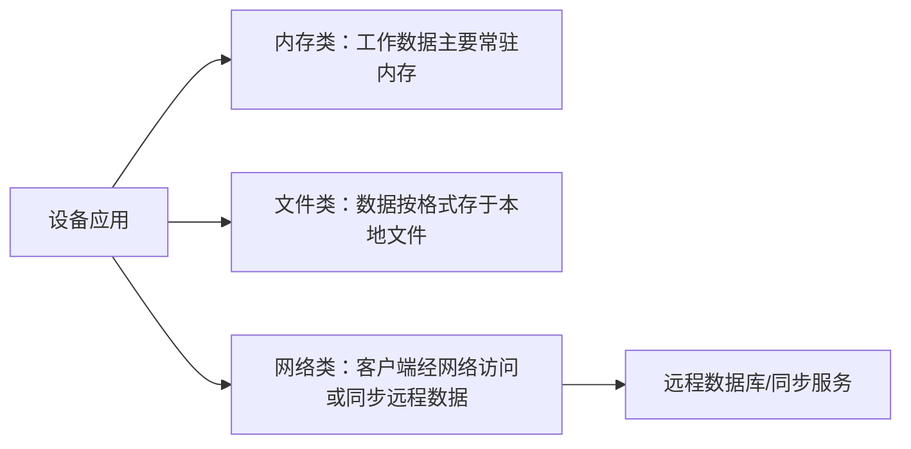

# 内存、文件与网络嵌入式数据库：数据放在哪里决定什么

同样是记录温度数据，把主要工作数据放在内存、放进本地文件，还是让设备同步远程数据服务器，会得到完全不同的速度、断网能力和复杂度。

**直接答案是：按存储位置，教材把嵌入式数据库常见架构分为内存、文件和网络三类；选择的核心是数据主要放哪里，以及设备怎样访问它。**

- **内存类**：主要工作数据常驻内存，减少磁盘 I/O 和排队等待带来的不确定性，适合对事务处理时间可预测性要求较高的场景。代价是要谨慎处理内存资源，以及断电后的持久化和恢复。
- **文件类**：数据以特定格式存放在本地文件，适合需要本地保存且部署简单的设备。教材提醒，若只要知道格式就能被程序直接读取，访问控制会较弱；不能把“文件存储”误解为天然安全。
- **网络类**：设备像客户端一样，经通信协议连接远程服务或通过同步服务映射、同步远程数据。它能利用远程数据能力，但也引入连接、同步和并发协调问题，不能假定网络随时可用。

这不是“内存最快，所以总选内存”的排序。温控设备离线也要持续工作时，本地数据能力更关键；大量终端要与中心数据一致时，网络与同步能力更重要；强时间约束还要继续验证实际事务与资源行为。

题目先抓数据位置和访问路径：出现“常驻内存、避免 I/O 等待”优先判断内存类；出现“按格式存为文件”判断文件类；出现“客户端、通信协议、远程服务器或同步服务”判断网络类。

> [!summary]- 快速复习卡片（学完再看）
> **内存类**：工作数据在内存，利于时间可预测性。
> **文件类**：本地文件存数据，部署简单但要单独处理访问控制。
> **网络类**：设备经网络访问/同步远程数据，需考虑连接与一致性。

无论数据放在哪里，数据库都还要解决存储、并发、事务与恢复这些基本功能。

## 自测

1. 题干出现“客户端、通信协议和远程服务器”三部分，最可能是哪类嵌入式数据库架构？

> [!answer]- 第 1 题答案与解析
> **答案**：网络类嵌入式数据库架构。
> **解析**：这是教材描述的嵌入式网络数据库的基本组成。
