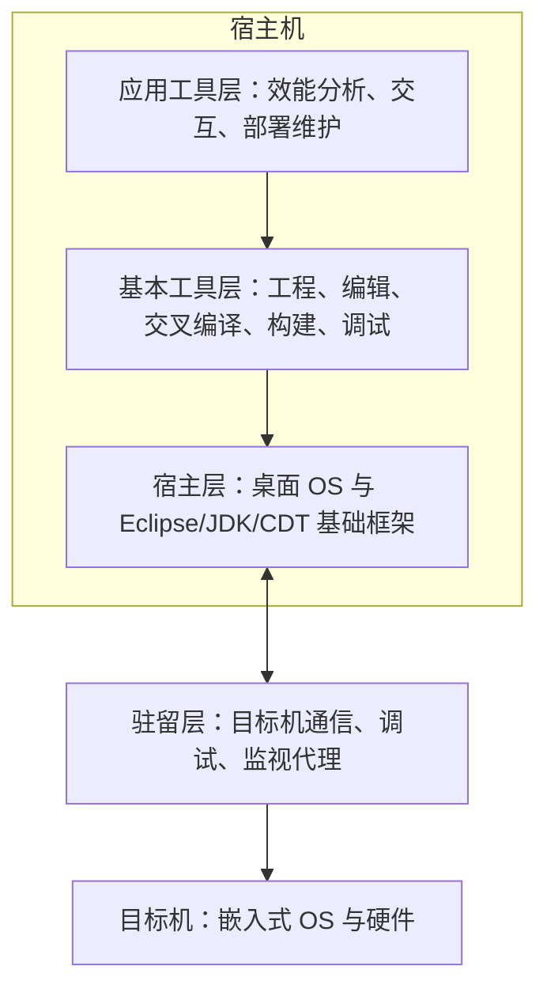

# 基于 Eclipse 的嵌入式开发环境：工具怎样分层连接宿主机和目标机

交叉开发并不是“装一个编译器”就结束：编辑、构建、调试、效能分析和部署工具要能协作，还要跨过宿主机与目标机之间的边界。

**直接答案是：教材给出的 Eclipse 式开发环境把工具分为宿主层、基本工具层、应用工具层和目标机驻留层；前三层在宿主机工作，驻留层在目标机提供通信和代理支持。**

教材中，Eclipse 是基于 Java 的可扩展开发平台；它提供框架和服务，开发环境可通过插件组件组装。这里要抓住的是“可扩展框架”的角色，而不是把 Eclipse 本身误当成一台目标机上的操作系统。

- **宿主层**：桌面操作系统之上的基础开发框架，如 Eclipse、JDK、CDT，给其他层提供 API 和插件机制。
- **基本工具层**：工程管理、编辑、交叉编译、连接、配置、调试、仿真和目标机管理等，覆盖日常开发主流程。
- **应用工具层**：在基本工具上增加效能分析、目标机交互、部署维护和第三方工具集成。
- **驻留层**：目标机上的可剪裁代理程序，向宿主机工具提供通信、调试、监视和交互服务。

分层不是为了把工具名称背成清单，而是把职责放对位置：宿主机负责“开发与控制”，目标机驻留层负责“配合与反馈”。题干若问“运行在目标机、为宿主机调试工具提供代理服务”，选驻留层；问“工程、编译、构建、调试的基本集合”，选基本工具层。

> [!summary]- 快速复习卡片（学完再看）
> **宿主机三层**：宿主层 → 基本工具层 → 应用工具层。
> **目标机一层**：驻留层，提供通信与代理。
> **易错点**：Eclipse 是可扩展的开发框架，不是目标机的业务软件。

了解环境层次后，下一篇用“工具链、OS 配套与安全/调试能力”比较教材列举的三类开发环境。

## 自测

1. 哪一层运行在目标机上，并向宿主机工具提供通信、调试和监视支持？

> [!answer]- 第 1 题答案与解析
> **答案**：驻留层。
> **解析**：驻留层的代理程序随目标机操作系统运行，配合宿主机的交叉开发工具。
