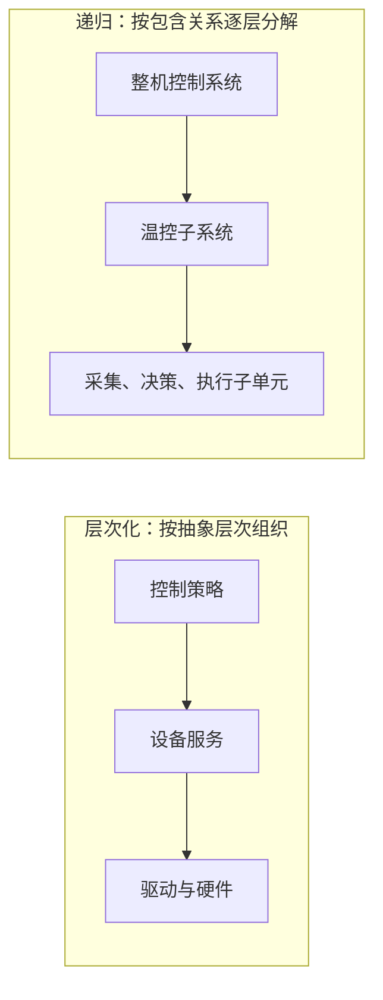

# 层次化与递归式嵌入式软件架构：复杂设备怎样分层或逐层拆解

前一篇已经知道，嵌入式软件必须跟着专用硬件和目标任务走。面对一台同时要采集、控制、通信和告警的设备，接下来要决定：是按抽象层次组织，还是把一个大问题不断拆成更小的同类问题？

**直接答案是：层次化模式用“上层依赖下层实现”来组织职责；递归模式用重复的包含关系把复杂系统逐层拆解。** 二者都在降低复杂度，但切入点不同。

## 两种办法分别解决什么

在**层次化模式**中，更抽象的概念由更具体的低层概念实现。温控策略不必知道串口寄存器怎样工作，只通过下层提供的服务完成“读取温度”“设置功率”。教材还区分两种访问约束：封闭型中，一层只能调用本层或紧邻的下一层；开放型中，一层可调用任一低层。开放型往往少绕一层、性能更好，但封装被破坏，移植性会变差。

在**递归模式**中，先把“整台设备怎样安全控温”拆成子系统，再把子系统拆成更具体的对象或服务；只要仍然复杂，就继续拆。教材强调它适合把复杂用例逐步求精，并在每一步检查可靠性和实时性。可以自顶向下，从系统开始逐步落到子系统；也可自底向上，先找已有的关键类和关系，再组合出更大的子系统。

它们不是二选一的产品标签：一个设备可以按层次隔离硬件细节，同时在某一层内部用递归方式分解复杂任务。题目要求“高层抽象由低层实现、关注不同层细节”时，优先判断层次化；要求“复杂系统持续分解、每层只是不同行细节”时，优先判断递归。

> [!summary]- 快速复习卡片（学完再看）
> **层次化**：按抽象高低组织；高层依赖低层实现。
> **递归**：按包含关系持续分解；适合复杂系统逐步求精。
> **易错点**：开放型层次访问更灵活，但会削弱封装和移植性。

组织好软件之后，仍要有一个统一调度任务、管理资源的底座：[[嵌入式操作系统：怎样在有限资源中统一管理任务和硬件]]。

## 自测

1. 题干说“把复杂控制系统拆成子系统，再继续拆到可验证的细节”，应优先选择哪种模式？

> [!answer]- 第 1 题答案与解析
> **答案**：递归模式。
> **解析**：递归模式通过重复应用包含关系，支持持续分解和逐步求精。
