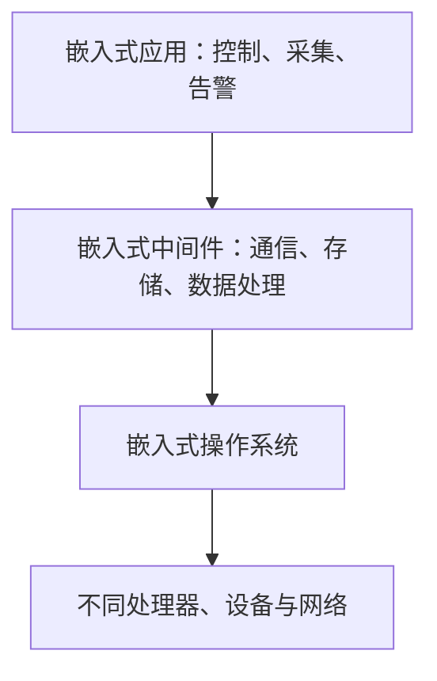

# 嵌入式中间件：怎样让不同设备上的应用不必直接适配底层差异

一套设备软件要跑在不同处理器、操作系统和网络环境中。若应用代码直接处理每一种通信方式、存储接口和系统差异，改一块板卡就可能牵动上层功能。

**直接答案是：嵌入式中间件位于嵌入式应用与操作系统之间，向上提供统一服务，向下屏蔽操作系统和硬件环境的异构差异。** 它是一类可复用软件，不是某一个固定产品。

教材把中间件定位在操作系统、网络和数据库之上、应用软件之下。它除了让系统“能连上”，还要让不同应用能互操作。对嵌入式系统而言，最常见的服务包括网络通信、存储管理和数据处理：应用调用标准接口，中间件再处理底层平台差异。

理解中间件时，可抓四个关键词：

- **通用性**：为一类应用提供可复用能力；
- **异构性**：跨硬件、操作系统和网络环境；
- **分布性**：让跨网络的组件或服务交互；
- **标准接口/协议**：减少每个应用分别适配的成本。

中间件不能替代操作系统，也不能替代具体业务。它依赖操作系统提供资源和网络基础；它的价值是把上层应用反复会遇到的通信、共享与数据处理问题抽成统一服务。教材也指出嵌入式中间件没有唯一固定架构，要按应用对象和约束选择。

题干若强调“应用不必关心底层 OS 差异、跨平台通信、标准 API、多个软件组件协作”，先识别嵌入式中间件；若题干问调度、内存分配等基础资源管理，仍应先回到嵌入式操作系统。

> [!summary]- 快速复习卡片（学完再看）
> **位置**：应用之下、操作系统之上。
> **作用**：屏蔽异构性，提供通信、存储和数据处理等统一服务。
> **易错点**：中间件不是操作系统，也不是业务应用。

中间件怎样组织通信，常见有“传消息”和“调对象”两条思路。

## 自测

1. 为什么嵌入式中间件能够降低应用对不同操作系统的依赖？

> [!answer]- 第 1 题答案与解析
> **答案**：它向应用提供较统一的接口，并在中间层处理底层操作系统和环境差异。
> **解析**：应用仍依赖中间件和操作系统，但不必逐一直接适配每个底层实现。
