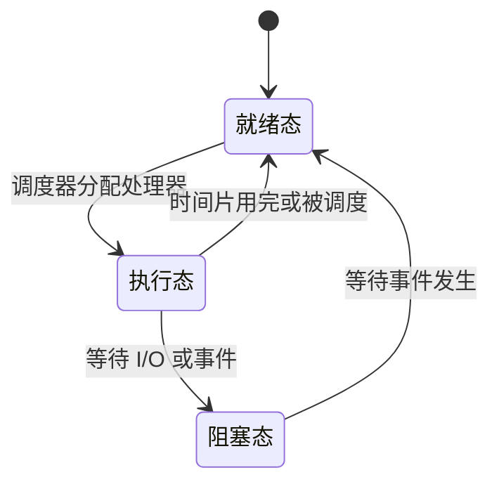

# 嵌入式操作系统任务管理：实时任务怎样按优先级和截止时间运行

温控任务要及时采样，告警任务一旦触发就要尽快执行，通信任务也不能永久饿死。处理器同一时刻只能直接执行一个任务，操作系统必须决定“此刻轮到谁”。

**直接答案是：任务管理把正在运行的程序当作可调度任务，记录其状态，并按调度规则把处理器分配给最合适的就绪任务。** 在实时系统里，“合适”往往还意味着不能错过截止时间。

教材把任务视为操作系统调度的最小单位，可先理解为“程序被加载进内存并开始执行后的工作单位”。任务最常见有三种状态：

操作系统不只做任务管理，还要管理内存、任务间通信、时钟和中断等资源；这一篇聚焦“选谁执行”。教材列出优先级抢占和时间片轮转两种常见方式：前者允许更关键的任务打断当前任务，后者让任务轮流占用时间片。抢占通常更利于关键任务及时响应，但会更复杂，也可能让低优先级任务久等。

把这些基本功能放回温控器：任务管理安排采样、控制和通信何时运行；**存储管理**给它们分配有限内存；**任务间通信**让采样结果安全交给控制任务；**时钟与中断管理**处理定时到点和外部事件。它们共同保证任务不只是“被选中”，还拥有运行所需的数据、协作条件和时间基准。

遇到实时题，可先按**比较依据**区分三种经典算法：

- **EDF（最早截止时间优先）**：谁的截止时间更早，谁优先；优先级会随当前截止时间变化。
- **LLF（最低松弛度优先）**：谁的“还剩多少可等待时间”最少，谁优先。教材的松弛度是“必须完成时间 − 所需运行时间 − 当前时间”。
- **RMS（单调速率调度）**：周期越短，静态优先级越高；适合周期性任务。

不要把“在线/离线、抢占/非抢占、静态/动态”误当作三种具体算法名称：它们是给调度方法分类的角度。比如运行前就确定信息的是离线调度；运行时才获得信息的是在线调度。RMS 是静态优先级；EDF 的优先级随截止时间变化。

做题先圈出题干的决定依据：出现“最早截止”选 EDF，出现“松弛/富裕时间最少”选 LLF，出现“周期越短优先级越高”选 RMS。只有题目给出数据时，再按它指定的抢占规则逐时间点推演。

## 抢占式 EDF 怎样处理一项后来变得更紧急的任务

下面是一组**解释性数据**，假设单处理器、允许抢占，截止时间均为绝对时刻：

| 任务 | 到达时刻 | 需要运行 | 截止时刻 |
| --- | ---: | ---: | ---: |
| A | 0 ms | 5 ms | 10 ms |
| B | 2 ms | 2 ms | 4 ms |

逐个事件点检查就绪任务的截止时刻：

| 时间段 | 就绪任务及截止时刻 | 选择与结果 |
| --- | --- | --- |
| 0–2 ms | A（10 ms） | 只有 A，先运行 2 ms；到 2 ms 时 A 还剩 3 ms。 |
| 2–4 ms | A（10 ms）、新到达的 B（4 ms） | B 截止更早，抢占 A，B 运行 2 ms 并在 4 ms 完成，正好赶上截止时间。 |
| 4–7 ms | A（10 ms） | B 完成后恢复 A；A 再运行 3 ms，于 7 ms 完成，也早于自己的 10 ms 截止时间。 |

这道题的第一步不是按任务编号轮流跑，而是在**任务到达或当前任务完成等调度事件发生时**，比较就绪队列里的截止时间；抢占式 EDF 允许新到达且截止更早的任务打断当前任务。若题目没有说明可抢占，就不能擅自采用这条抢占路径。

> [!summary]- 快速复习卡片（学完再看）
> **三状态**：就绪（等 CPU）→ 执行；执行可因等待事件进入阻塞；事件到达后回就绪。
> **算法辨认**：截止时间早 → EDF；松弛度小 → LLF；周期短 → RMS。
> **易错点**：在线/离线、抢占/非抢占、静态/动态是分类维度，不是算法名。

调度机制说明“怎样运行”；选用哪种操作系统产品还要回到设备领域、实时约束和产品能力来比较。

## 自测

1. 一个任务还剩 4 ms 执行时间，必须在当前时刻后 10 ms 完成，它的松弛度是多少？

> [!answer]- 第 1 题答案与解析
> **答案**：6 ms。
> **解析**：把“距必须完成还剩 10 ms”减去“自身还需运行 4 ms”，得到可等待的富裕时间 6 ms。

2. 两个周期性任务中，一个周期为 20 ms，另一个为 50 ms。RMS 优先选谁？

> [!answer]- 第 2 题答案与解析
> **答案**：周期为 20 ms 的任务。
> **解析**：RMS 按周期分配静态优先级，周期越短优先级越高。

3. 上例在 2 ms 时 B 到达，A 还剩 3 ms，EDF 为什么改为执行 B？

> [!answer]- 第 3 题答案与解析
> **答案**：B 的绝对截止时间是 4 ms，早于 A 的 10 ms；在题设允许抢占时，B 优先。
> **解析**：EDF 在调度时选择就绪任务中截止时间最早者。这个判断依赖“允许抢占”的题设条件。
