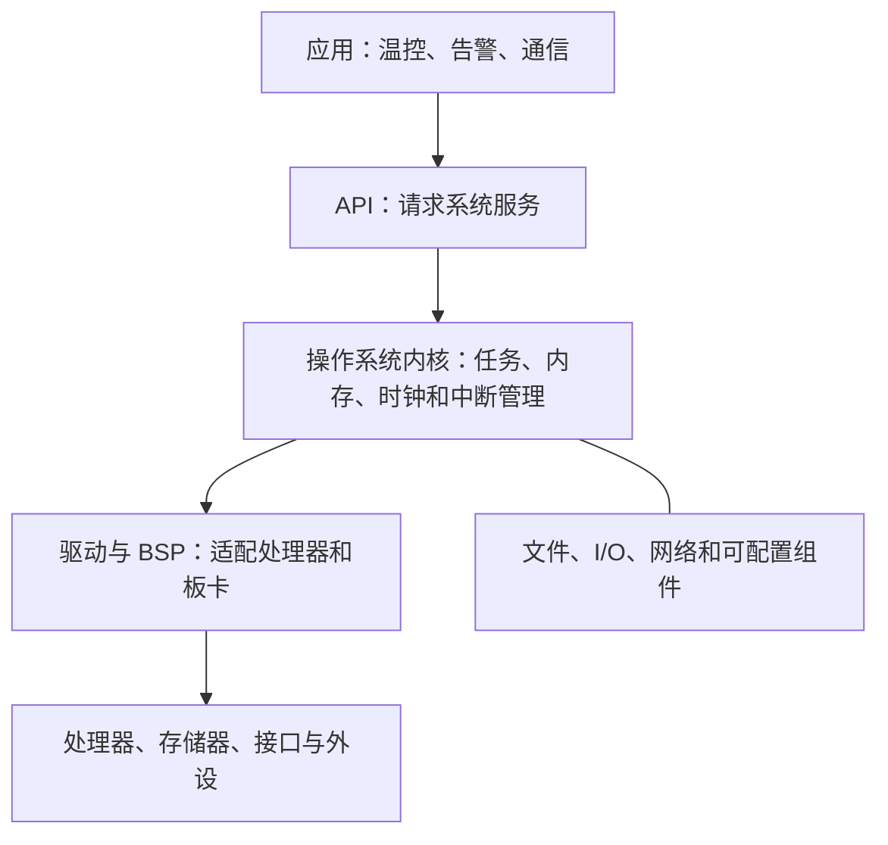

# 嵌入式操作系统：怎样在有限资源中统一管理任务和硬件

温控设备既要周期性读传感器，又要控制加热、响应网络命令、记录故障。若每个功能都直接争抢处理器、内存和接口，谁先运行、出了冲突怎么办就会变成一团乱。

**直接答案是：嵌入式操作系统（EOS）是运行在嵌入式设备上的系统软件，统一分配软硬件资源、调度任务，并协调并行活动。** 它是应用与具体硬件之间的管理层，不是温控、支付之类的业务功能本身。

教材指出，EOS 会承担资源分配、任务调度、控制和协调并行活动等工作。它通常包含内核、硬件相关驱动、文件系统和可配置组件，并向应用提供 API（应用程序接口）。可以把 API 理解成应用向操作系统请求服务的规范入口，而不是直接操作每个硬件寄存器。

从零基础角度，记住这四类特点就够用：

- **可剪裁、可定制**：只保留目标设备需要的组件，适应有限资源；
- **实时和确定性**：控制类任务需要在规定时间内得到处理；
- **稳定、紧凑**：设备常无人值守，代码也不能无谓占用存储和内存；
- **硬件适应与可移植**：驱动、结构支持包（ASP）和板级支持包（BSP）处理硬件差异，核心服务尽量不随一块板卡完全重写。

教材还列出整体、层次、客户/服务器、面向对象等操作系统内部结构。这里先建立判断边界：它们是 EOS 的内部组织选择，不等同于上一站的“嵌入式系统整体架构模式”。

题目若出现“任务调度、资源分配、设备驱动、内核、向应用提供标准 API”，第一步识别 EOS；若强调“可剪裁、强实时、强确定性、通常固化在 ROM”，也是嵌入式操作系统的典型特征。

> [!summary]- 快速复习卡片（学完再看）
> **是什么**：EOS 统一管理嵌入式系统的资源和任务。
> **结构主线**：应用 → API → 内核/系统组件 → 驱动与 BSP → 硬件。
> **题干信号**：可剪裁、实时、确定性、资源受限、固化 → 优先判断 EOS。

有了统一管理者，还要看它具体怎样选出下一个任务执行：[[嵌入式操作系统任务管理：实时任务怎样按优先级和截止时间运行]]。

## 自测

1. 为什么嵌入式操作系统需要“可剪裁”？

> [!answer]- 第 1 题答案与解析
> **答案**：因为目标设备资源有限，系统应保留需要的组件、避免无用代码。
> **解析**：可剪裁性服务于资源约束和定制需求，不是指随意删除关键管理功能。
