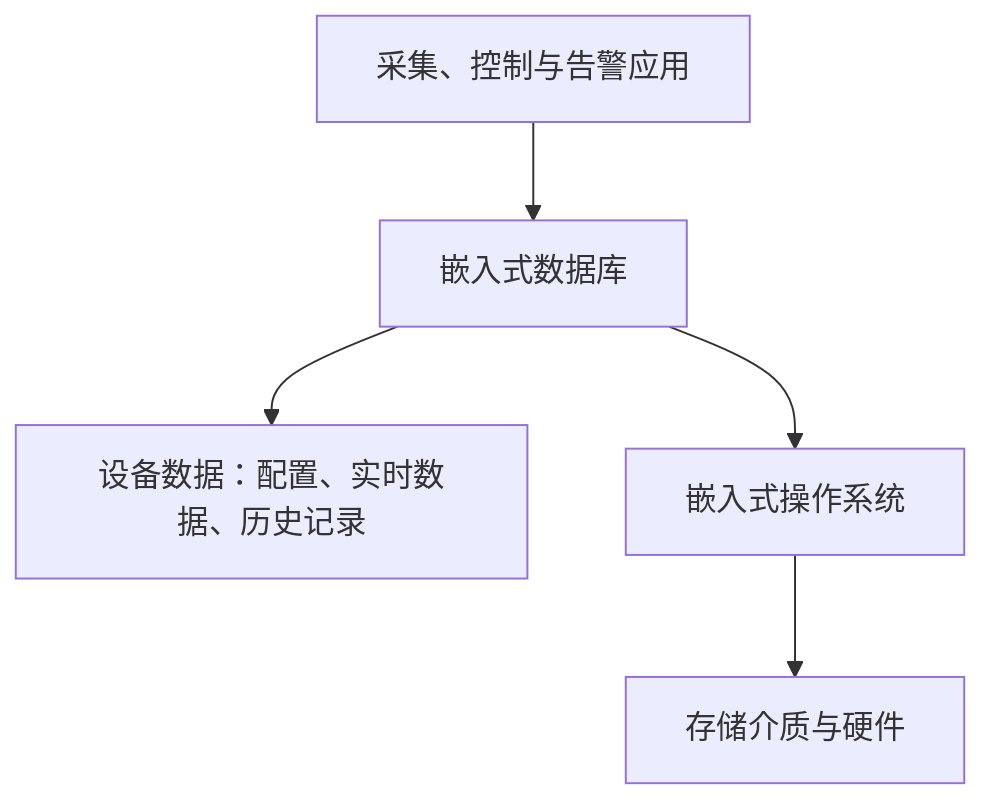

# 嵌入式数据库：设备怎样在有限资源中可靠保存数据

一台工业采集设备要持续记住传感器数据、告警记录和设备配置。只把它们散落在文本文件里，查询、并发修改、断电恢复都会越来越难处理。

**直接答案是：嵌入式数据库是随应用或设备一起运行的轻量级数据管理能力，用较少资源组织、存取并保护设备数据。** 它通常和应用进程紧密结合，不等同于必须单独部署在另一台机器上的数据库服务器。

教材强调两点：嵌入式设备常有资源与时间限制，数据库操作要尽量可预知；设备又可能长期无人值守，因此可靠性不能只靠人工补救。嵌入式数据库可通过 SQL 或 API 帮应用管理数据，避免应用自己直接拼接和维护一堆原始数据文件。

它的常见特征可以这样理解：

- **嵌入性与轻量化**：数据库随软件或设备部署，运行时通常希望少占内存和代码空间；
- **可预知性**：若设备有时间限制，不能只看平均速度，也要控制访问和资源使用的不确定性；
- **可靠性**：断电、异常或长期运行后，仍要考虑数据一致性和恢复；
- **伸缩与适配**：不同处理器、存储介质和应用目标会影响设计取舍。

“嵌入式”不自动等于“实时”。教材明确指出，要获得良好实时性还需额外设计；若题目只有“数据库嵌入应用进程、随应用发布”，先判断嵌入式数据库，不能直接推出它一定满足严格截止时间。

> [!summary]- 快速复习卡片（学完再看）
> **是什么**：面向设备、与应用紧密结合的轻量级数据管理能力。
> **为什么需要**：有限资源下仍要可靠、可预知地管理共享数据。
> **易错点**：嵌入性不等于自动具备强实时性。

下一站比较数据放在内存、文件还是远程网络一侧时，结构会怎样改变。

## 自测

1. 数据库和应用运行在同一进程、随应用一起发布，最先应识别为什么架构特征？

> [!answer]- 第 1 题答案与解析
> **答案**：嵌入式数据库的嵌入式运行方式。
> **解析**：它区别于独立服务器进程的客户机/服务器部署方式。
