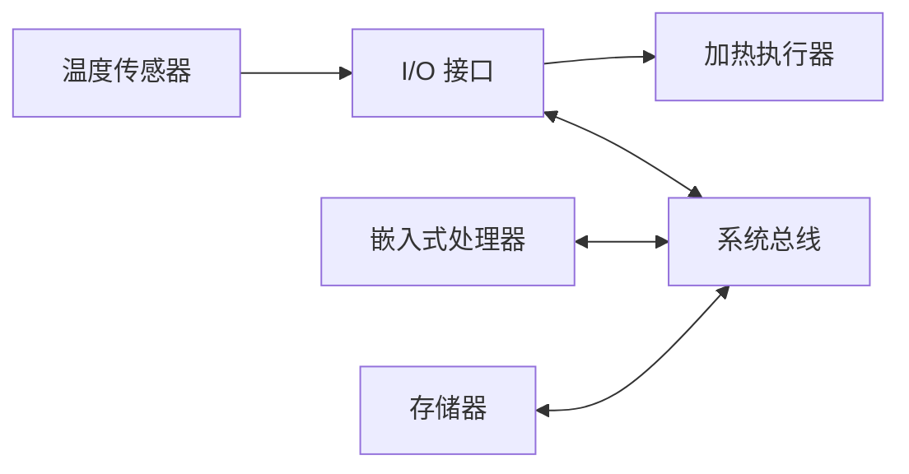

# 嵌入式系统硬件组成：处理器、存储、总线和接口怎样一起完成专用任务

上一站知道嵌入式系统为专用任务服务。现在以“温控器读到温度过低后启动加热”为例，看任务怎样在硬件中流动。

**直接答案是：处理器负责按程序作出判断，存储器保存程序和运行数据，总线负责在部件间传信息，I/O 接口负责把计算机接到传感器和执行器。** 这几类部件相互配合，才让专用设备能感知、计算并控制。

图中的总线是处理器、存储器和 I/O 接口之间传递数据、地址及控制信号的通道；传感器和执行器等外部设备经 I/O 接口连接系统。温度读数由传感器进入接口，经总线到处理器；处理器访问存储器中的程序/数据作判断，再经总线和接口输出控制动作。

温度传感器的读数先经 **I/O（输入/输出）接口**进入处理器；处理器从存储器取出控制程序和当前数据，判断是否该启动加热；再经接口向执行器发出动作。教材列出的典型硬件还包括定时器/计数器、看门狗和外部设备。

### 四个部件各自做什么

- **嵌入式处理器**：执行控制程序。教材列举 MPU、MCU、DSP、GPU、SoC 等类型；选哪一种要匹配任务和环境，而不是只比较名称。
- **存储器**：保存程序、配置或运行数据。可先用“运行时要读写的数据”和“需要较长期保留的内容”来理解，具体器件选择还受容量、速度和断电保持要求影响。
- **总线**：各功能部件共用的信息通道。教材区分数据总线、地址总线和控制总线：分别传数据、指明位置、传控制信号。
- **I/O 接口**：处理器与外部世界交换信息的纽带，例如串口、网络、USB、定时器接口等。

硬件组成回答的是“任务能否跑起来”，并不等于软件架构已经设计好。对温控器来说，接口把温度送进来、处理器算出动作、接口再把动作送出去；软件还要决定这些步骤怎样组织、异常怎样恢复。

> [!summary]- 快速复习卡片（学完再看）
> **主线**：接口采集/输出；处理器执行；存储器保存；总线传递。
> **题干信号 → 第一反应**：问部件间传输信息 → 总线；问与外部设备交换 → I/O 接口。
> **易错点**：总线不是处理器，I/O 接口也不等于外部设备本身。

当程序没有按预期循环、卡死或跑飞时，即使这些部件都在，也需要一个能促使系统恢复的机制：[[看门狗电路：程序跑飞后怎样让设备自己恢复]]。

## 自测

1. 温度传感器读数要送给处理器，最直接对应哪一类部件？

> [!answer]- 第 1 题答案与解析
> **答案**：I/O 接口。
> **解析**：I/O 接口是处理器同被控对象或外部设备交换信息的纽带；总线主要在系统功能部件之间传递信息。
