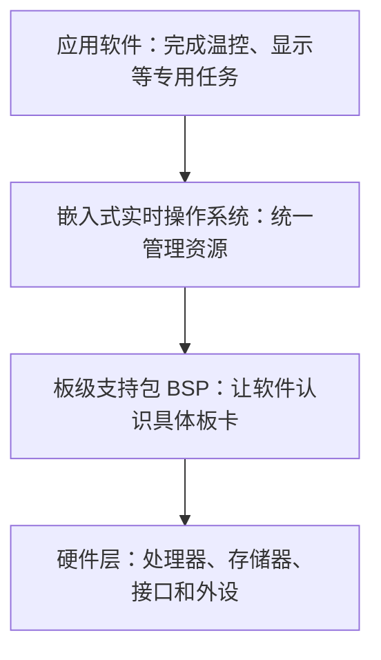

# 嵌入式软件架构：为什么软件结构必须跟硬件和专用目标一起设计

同样是“控制温度”，有的设备只需一个简单循环，有的却要同时处理传感器、网络、显示和故障告警。把所有代码堆在一起，会让资源使用和故障处理越来越难判断。

**直接答案是：嵌入式软件架构是在专用硬件和应用目标约束下，安排应用、操作系统支持和硬件支持怎样协作的结构。** 它不能脱离目标设备照搬一套通用模板。

教材描述了一个容易理解的演进：早期单片机系统规模很小，软件大致只有监控程序和应用软件两层；随着任务变复杂，嵌入式操作系统开始统一管理计算机资源，应用也更多使用高级语言和配套开发环境，软件架构才逐渐形成。

一个简单的层次可以这样理解：

其中，**BSP（板级支持包）**可以先理解为把操作系统或底层软件接到具体硬件板上的适配层；**RTOS（实时操作系统）**则是在有时间要求的场景中帮助管理任务和资源的操作系统。它们的具体实现会随设备而变。

教材特别提醒：因为嵌入式系统具有专用性，架构与目标系统紧密结合，通常没有唯一通用架构。设计时要先看应用目标、系统复杂度和功能大小，再选合适的组织方式。教材后续会展开两类典型方式：层次化模式和递归模式；本篇只先建立“为什么不能照搬”的总框架。

做题时，若题干强调“专用设备、硬件约束、资源统一管理或板级适配”，先判断它讨论的是嵌入式软件架构的层次与依赖；不要把“有操作系统”误解为“所有嵌入式系统的软件结构完全相同”。

> [!summary]- 快速复习卡片（学完再看）
> **核心结论**：嵌入式软件架构必须服务专用目标，并适配具体硬件。
> **简单层次**：应用 → 嵌入式（实时）操作系统 → BSP → 硬件。
> **易错点**：教材明确说明通常没有唯一通用架构，应按目标与复杂度选择。

下一站会比较两种典型组织方式：层次化与递归式嵌入式软件架构。

## 自测

1. 为什么不能认为嵌入式软件存在一套适用于所有设备的固定架构？

> [!answer]- 第 1 题答案与解析
> **答案**：因为嵌入式系统面向专用目标，软件架构与具体硬件、系统复杂度和功能大小紧密相关。
> **解析**：通用层次可用于理解依赖关系，但实际设计仍要根据目标系统取舍。
