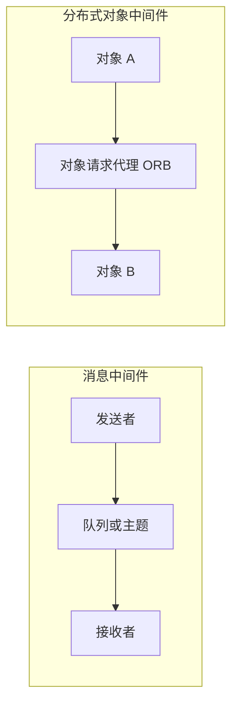

# 消息与分布式对象中间件：组件怎样异步传话或透明调用

传感器网关采集到告警后，后续处理服务可能暂时离线；另一类场景中，一个软件组件想像调用本地对象一样调用远程能力。它们都需要中间件，但协作方式不一样。

**直接答案是：消息中间件让发送者把消息交给队列或主题后异步传递；分布式对象中间件让对象通过统一请求代理相互调用，尽量屏蔽本地与远程的差异。**

### 消息中间件：先交付消息，再由对方处理

消息队列是保存与中继消息的容器。发送者把消息写入队列或主题后，不需要等待接收者立即回应；接收者可稍后订阅或监听。这带来异步和松耦合：双方不必同时在线，也不必了解对方内部实现。教材还提醒，消息保存有期限，不能把队列当成永不丢失的无限存储。

常见模型有两种：**点对点**是一个生产者把消息交给由名称标识的特定消费者；**发布/订阅**是发布者向主题发布，多个订阅者可接收感兴趣的消息。

### 分布式对象中间件：像调用服务对象一样协作

分布式对象中间件面向异构分布计算和代码复用。对象提供接口和服务，对象请求代理 **ORB**（Object Request Broker）像“软件总线”，把请求送到本地或远程对象；应用不必先区分调用跨不跨机器。对象接口常用 IDL（接口定义语言）描述。

做题时，出现“队列、主题、订阅、发送方不等响应”优先判断消息中间件；出现“对象、ORB、IDL、远程对象调用对应用透明”优先判断分布式对象中间件。两者都帮助解耦，但前者的主线是消息流转，后者的主线是对象服务调用。

> [!summary]- 快速复习卡片（学完再看）
> **消息**：队列/主题、异步、发送接收可不同步。
> **对象**：ORB、对象接口、远程调用透明。
> **易错点**：队列可暂存不代表永久保存；对象透明也不代表不存在网络代价。

下一篇把教材常提到的 CORBA 与 DDS 放进这两种协作思路中比较。

## 自测

1. 题干说“发布者向主题发布，多个订阅者各自接收”，对应哪种模型？

> [!answer]- 第 1 题答案与解析
> **答案**：消息中间件的发布/订阅模型。
> **解析**：它以主题为中心，发布者与订阅者彼此可不直接了解。
