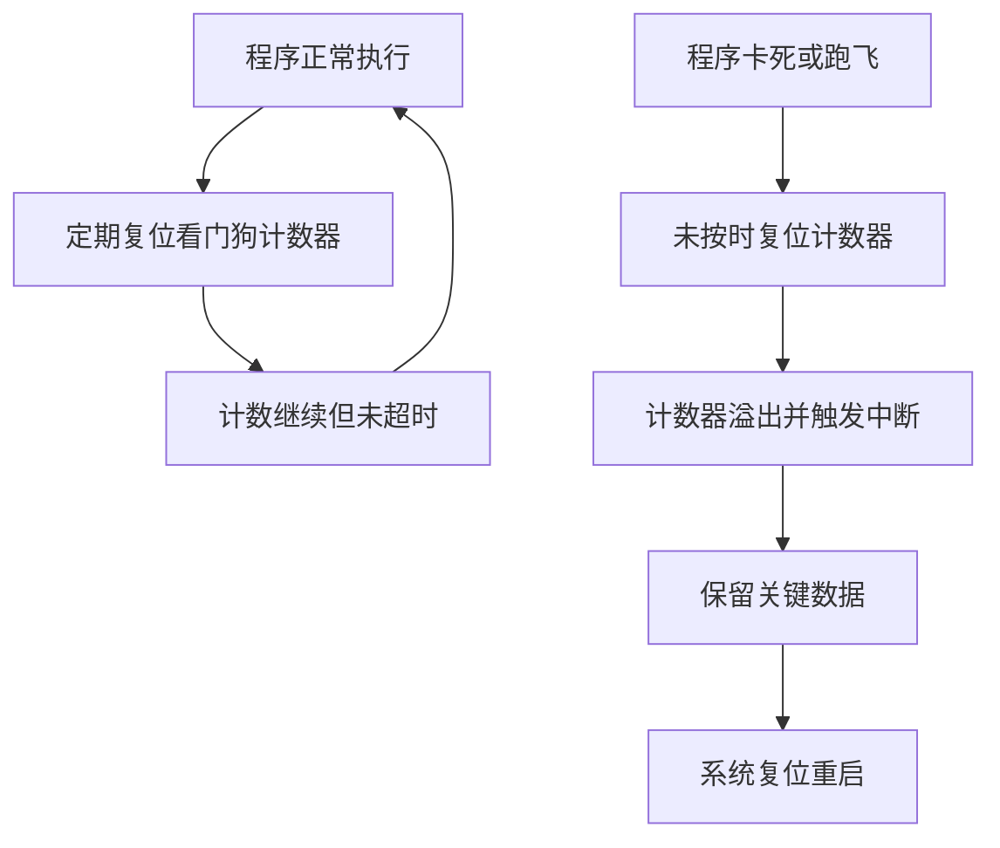

# 看门狗电路：程序跑飞后怎样让设备自己恢复

一个无人值守的温控器如果程序卡在某一步，既不再读取温度，也不再输出控制动作。现场没有人按重启键时，设备怎样知道“程序可能出问题了”？

**直接答案是：看门狗用一个持续计时的计数器检查程序是否还在正常运行；程序按时“报到”就清零，长期没有报到就触发恢复和重启。**

教材说明，看门狗的作用是当软件出问题或程序跑飞时让系统重新启动。可以把它理解成一份定时签到：正常程序每隔一段时间把看门狗计数器复位；若程序卡死或跑飞，复位动作不再发生，计数器溢出后进入中断处理。系统可在设定的短时间内保留关键数据，然后复位重启。

看门狗提供的是**故障后的恢复机会**，不是保证程序永不出错。它也不能替代业务层的输入校验、异常处理和根因修复；如果每次重启后仍走到同一个错误，故障会反复出现。

做题时，看到“程序跑飞、卡死、无人值守、超时后自动重启”，第一步就把它和看门狗联系起来；若题目问正常运行时软件做什么，答案是**定期复位（喂）看门狗计数器**，而不是等待它溢出。

> [!summary]- 快速复习卡片（学完再看）
> **作用**：发现程序长期未正常运行后，触发系统恢复。
> **机制**：正常时定期复位计数器；未复位 → 溢出/中断 → 保存关键数据 → 重启。
> **易错点**：看门狗负责恢复，不负责消除原有软件缺陷。

硬件有了基本自恢复能力后，还要决定软件怎样分层、怎样使用操作系统和硬件资源，这就是下一篇的软件架构问题。

## 自测

1. 看门狗在正常情况下为什么要被程序定期复位？

> [!answer]- 第 1 题答案与解析
> **答案**：用来证明程序仍在正常运行，避免计数器超时触发恢复。
> **解析**：若程序卡死或跑飞，通常无法再执行复位动作，计数器才会溢出并触发恢复流程。
