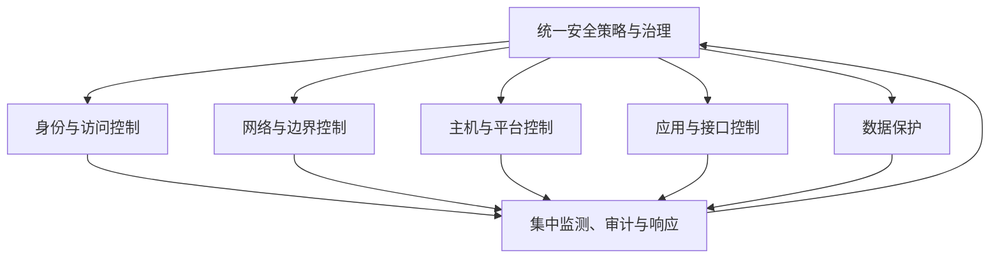

# 分层安全体系与企业安全控制：怎样把多层防线组织成可运营的整体

> [!summary]- 快速复习卡片（学完再看）
> **一句话**：分层安全体系是在不同位置布置互补控制；企业安全控制系统再把这些控制用统一策略、身份、监测、审计和响应能力联动起来。
> **第一动作**：题目出现“整体安全架构”，先找资产和信任边界，再按身份、网络、主机、应用、数据、监测响应分层，不要先列产品名。
> **易错点**：分层不是固定串行流程；企业安全控制也不是“再买一个集中平台”。

## 为什么“每层都有安全产品”仍可能不安全

某企业已经部署防火墙、主机防护、WAF、数据库审计，但仍可能出现两个问题：

1. **层与层之间有空隙**：账号已经异常，却仍能穿过网络和应用层访问敏感数据；
2. **控制彼此不知道发生了什么**：身份平台发现异地登录，审计平台发现批量下载，但没有形成联动处置。

所以安全架构不能只回答“有哪些防线”，还要回答：

> **防线放在哪里、各自保护什么、谁统一下策略、谁汇总证据、异常后怎样联动。**

## 分层安全体系到底“分”什么

分层不是教材目录的机械分组，而是围绕攻击路径和资产位置安排不同职责。

| 层次 | 主要问题 | 典型控制职责 |
| --- | --- | --- |
| 身份与访问 | 你是谁、能做什么 | 认证、授权、最小权限、强认证 |
| 网络与边界 | 哪些通信可以通过 | 分区隔离、访问控制、加密通信、边界防护 |
| 主机与平台 | 运行环境是否可信 | 加固、补丁、恶意代码防护、主机监测 |
| 应用与接口 | 业务入口是否被滥用 | 输入校验、接口鉴权、应用防护、安全开发 |
| 数据 | 敏感数据怎样被使用 | 权限、加密、完整性、脱敏、备份恢复 |
| 监测与响应 | 前面失效后怎样发现和止损 | 日志、审计、告警、关联分析、响应、恢复 |

同一请求不一定严格按这张表从上到下经过所有层。这里的“层”表达的是**职责边界和互补关系**。

## 为什么这就是纵深防御的架构化

[[纵深防御]]强调“一道防线失效，后面还有别的控制”。分层安全体系进一步把这个思想落到架构位置：

- 账号失守，最小权限和网络隔离继续限制横向移动；
- 网络边界失守，主机和应用控制继续限制利用；
- 应用漏洞被利用，数据库权限和数据控制继续限制损失；
- 预防措施都没拦住，日志、审计、响应和恢复负责发现与止损。

因此考试看到“多层、多点、一道失效仍有后续控制”，优先想到**纵深防御/分层安全体系**。

## 企业安全控制系统比“分层”多了什么

只把控制分层，还可能各自为政。企业级安全控制系统关注的是把这些控制组织成**统一可治理、可观察、可联动**的整体。

可以把它记成五类架构能力：

1. **统一策略**：把安全要求转成各层可执行规则；
2. **统一身份与权限基础**：减少各系统各管一套账号造成的失控；
3. **集中监测与审计**：把分散日志和事件汇聚起来，形成跨层证据；
4. **关联分析与联动响应**：把多个弱信号组合成事件，并触发隔离、降权、阻断等动作；
5. **恢复与持续改进**：事件后恢复业务，再根据证据修订策略和控制。

这不是说所有产品必须由一个平台替代，而是要求**控制面能够协同**。

图表达的是**策略下发 + 事件汇聚 + 反馈改进**，不是业务请求的固定执行流程。

## 和三体系、WPDRRC是什么关系

不要把几个概念背成互相替代的答案：

- **技术/组织/管理三体系**：回答完整安全保障由哪些方面共同构成；
- **分层安全体系**：回答技术控制分别放在哪些位置、怎样形成纵深；
- **WPDRRC**：回答运行时不能只有保护，还要有预警、检测、响应、恢复等动态能力；
- **企业安全控制系统**：回答跨层控制怎样统一治理、汇聚证据并联动。

它们可以同时出现在一个方案中。

## 案例题第一动作

题目要求“设计企业整体安全架构”时，按下面顺序检查：

**资产/信任边界 → 分层布控 → 统一身份和策略 → 集中审计监测 → 联动响应恢复 → 组织与制度保障。**

这是答题检查链，不代表真实流量按这个顺序串行。

## 自测

1. 企业已经有防火墙、WAF、主机防护和数据库审计，为什么仍可能需要企业安全控制能力？

> [!answer]- 第 1 题答案与解析
> **答案**：因为这些控制可能各自独立，缺少统一策略、跨层事件关联和联动响应；“有设备”不等于形成整体架构。

2. 分层安全体系与纵深防御是什么关系？

> [!answer]- 第 2 题答案与解析
> **答案**：纵深防御是“一层失效还有下一层”的原则；分层安全体系把这个原则落实到身份、网络、主机、应用、数据和监测响应等架构位置。

## 下一站

分层安全体系解决“控制放在哪里并怎样协同”；下一步进入标准化安全服务视角：[[OSI安全体系结构]]，再拆鉴别、访问控制、机密性、完整性和抗抵赖框架。
