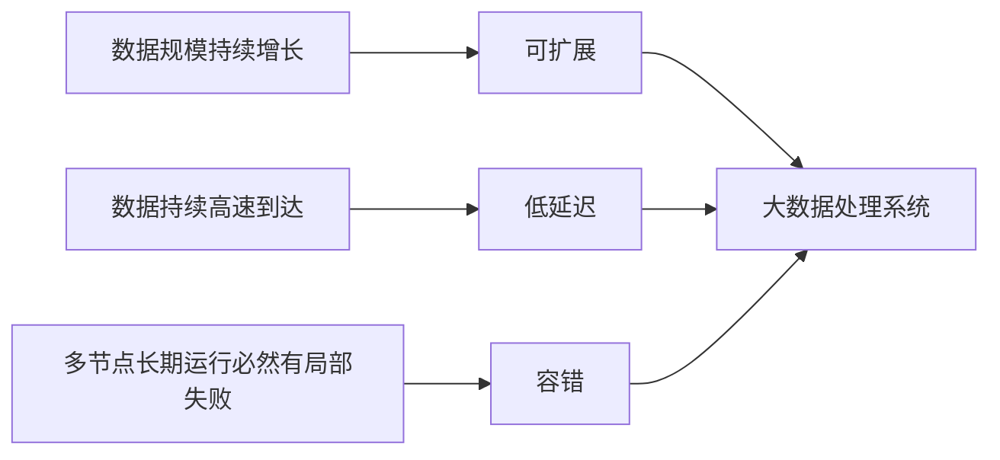

# 大数据处理系统：为什么 4V 还不等于架构特征

> [!info] 承接
> 综合知识 [[13_大数据：为什么需要与云协同支撑全局智能]] 已经回答“数据为什么变成新问题”：Volume、Velocity、Variety、Value，以及获取→清洗→集成→分析→解释的处理链。本篇不重复 4V，而是继续回答：**为了长期处理这类数据，系统架构本身必须具备什么能力？**

> [!summary]- 快速复习卡片（学完再看）
> - **核心结论：** 4V 描述“数据/问题”，容错、低延迟、可扩展等描述“处理系统怎样应对问题”。
> - **题干信号：** 节点故障仍继续、数据增长可横向扩容、实时结果、吞吐与延迟权衡。
> - **第一动作：** 先区分题目在问“大数据特征”还是“大数据处理系统架构特征”。
> - **易错：** 不能用“Volume/Velocity/Variety/Value”直接回答“架构应具备哪些能力”。

## 先把两个“特征”分开

| 问题 | 关注对象 | 典型答案 |
| --- | --- | --- |
| 大数据有什么特征？ | 数据与业务问题 | 规模大、速度快、类型多、要产生价值 |
| 大数据处理系统有什么架构特征？ | 处理这些数据的平台 | 容错、低延迟、可扩展，并在吞吐、实时性、复杂度之间权衡 |

这就是 A001 的边界：**FUT-A013 继续作为 4V 与处理链的唯一主事实源；本篇只补架构能力。**

## 为什么需要容错

大数据平台通常把数据和计算分散到多个节点。节点越多，长期运行时遇到机器、网络、进程故障就越正常。

因此架构不能假设“所有节点永远健康”，而要把失败当作常态：通过数据副本、任务重试、状态恢复等机制，让局部故障不等于全局失败。

**考试动作：** 题干出现“某节点宕机但任务继续”“局部失败自动恢复”，先想到**容错能力**。

## 为什么需要低延迟

Velocity 不只表示“数据来得快”，还会把压力传给系统：如果业务要求风控、告警、推荐等结果尽快产生，平台就不能永远等一个超大离线批次结束。

因此大数据架构常要在批处理吞吐和实时处理延迟之间做选择。后面的 Lambda 与 Kappa，本质上就是围绕“历史重算 + 实时结果”怎样组织计算路径的两种典型答案。

## 为什么需要可扩展

Volume 持续增长时，单机纵向升级会碰到容量、成本和硬件上限。大数据系统更强调通过增加节点扩展存储和计算能力。

所以题干出现“数据量翻倍，希望通过增加机器承载”，对应的是**横向可扩展性**，而不是简单把单机换成更强配置。

## 三个能力怎样串起来

不要把它背成孤立名词。逻辑是：**大规模迫使系统分布式扩展；分布式节点越多越要容错；高速数据和实时业务又要求降低结果延迟。**

## 与下一站的关系

知道“平台要容错、低延迟、可扩展”后，下一问自然是：**历史数据要算得准，实时数据又要尽快出结果，计算路径到底怎样组织？**

下一站进入 [[02_Lambda架构：为什么同时保留批处理层和速度层]]。

## 考前一句话

**4V 是问题特征；容错、低延迟、可扩展才是处理系统为解决这些问题表现出的架构能力。**
