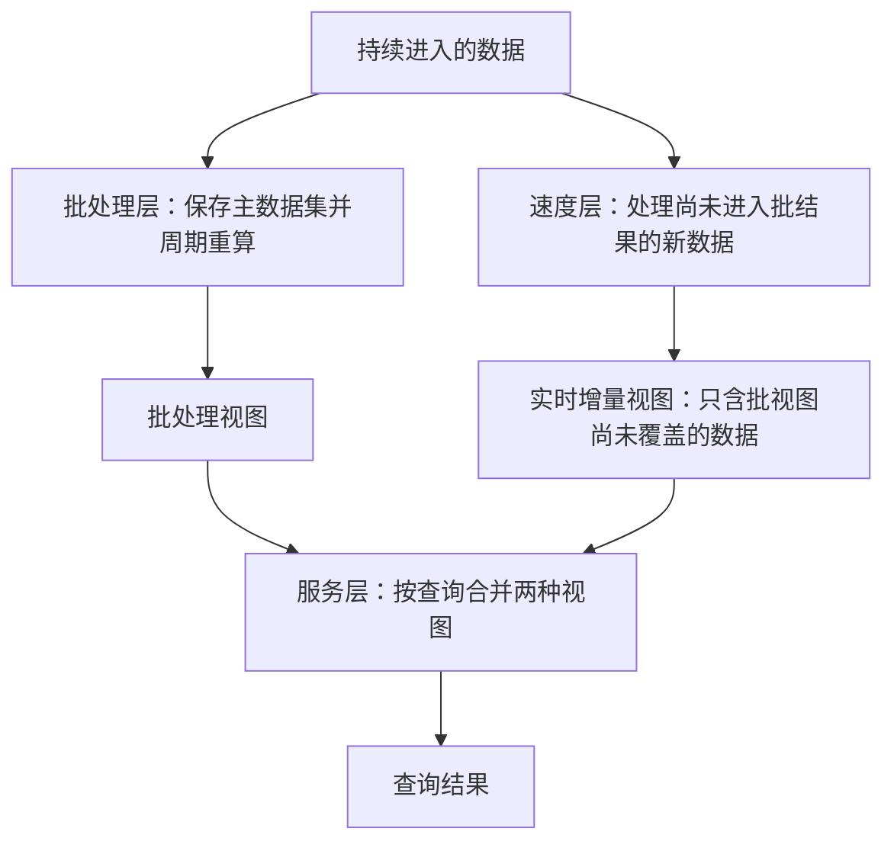

# Lambda 架构：为什么同时保留批处理层和速度层

> [!info] 承接
> 上一站已经知道，大数据平台既希望历史结果可靠，又希望新数据尽快可见。Lambda 的答案不是强迫一条计算链同时做到两件事，而是**把历史批处理与实时增量处理分成两条路径，查询时再合并结果。**

> [!summary]- 快速复习卡片（学完再看）
> - **核心结论：** Lambda = 批处理层 + 速度层 + 服务层。
> - **第一动作：** 题干出现“历史全量准确 + 新数据实时补偿”，先识别 Lambda。
> - **关键代价：** 同一业务逻辑往往要在批、流两套链路维护，复杂度和一致性成本更高。

## 为什么不能只做批处理

只做批处理时，可以周期性读取完整历史数据并重新计算，结果容易校正，但新数据必须等下一批任务，延迟较高。

## 为什么不能只靠实时增量

只靠实时处理能快速给出结果，但长期运行会面对乱序、迟到数据、程序缺陷和历史逻辑变更。若没有可靠的历史重算路径，纠错会更困难。

Lambda 因此把两种诉求拆开。

## 三层怎么协作

### 批处理层

保存完整、不可随意丢失的历史数据，并周期性对全量数据重新计算。它的优势是：历史逻辑可以重放，错误结果可以通过重新计算修正。

> [!note] 批处理层的主数据集
> 教材强调主数据集应尽量保持**原始、不可变、真实**。这样算法或程序出错后，可以回到原始事实重新计算，而不是在已经被覆盖的数据上继续修补。

### 速度层

专门处理“批处理层还没来得及覆盖”的最新数据，先给出低延迟结果。等新的批处理结果生成后，对应实时结果就可以被替换或合并。

### 服务层

把批处理结果组织成可查询视图，并与速度层的最新结果一起服务查询。

## 一个最小例子

假设统计网站当天订单额：

- 凌晨到 10:00 的历史订单已经进入批处理结果；
- 10:00 之后刚到的新订单由速度层立即累计；
- 本例把 10:00 当作批处理视图已覆盖的分界点；实时视图只累计 10:00 之后、尚未并入批结果的订单；
- 服务层查询时，把“截至分界点的批结果 + 分界点之后的实时增量”组合起来。批视图更新后，分界点也要随之更新，避免同一订单被两边重复计算或两边都漏掉。

因此 Lambda 不是“数据复制两份就结束”，而是**用两套计算路径分别解决准确重算和低延迟，再在查询侧汇合。**

## 代价为什么明显

同一指标可能需要同时维护批处理实现和实时实现：

- 两套代码或计算逻辑；
- 两套运行与监控链路；
- 批结果与实时结果要保证语义一致；
- 故障排查时要判断问题来自哪条路径。

这正是下一站 Kappa 试图简化的地方。

## 考前一句话

**Lambda 用“批处理层保证历史重算 + 速度层保证实时结果 + 服务层统一查询”换取准确性与低延迟，但代价是双链路复杂度。**

下一站：[[03_Kappa架构：为什么只保留流处理主链并依靠日志重放]]。
