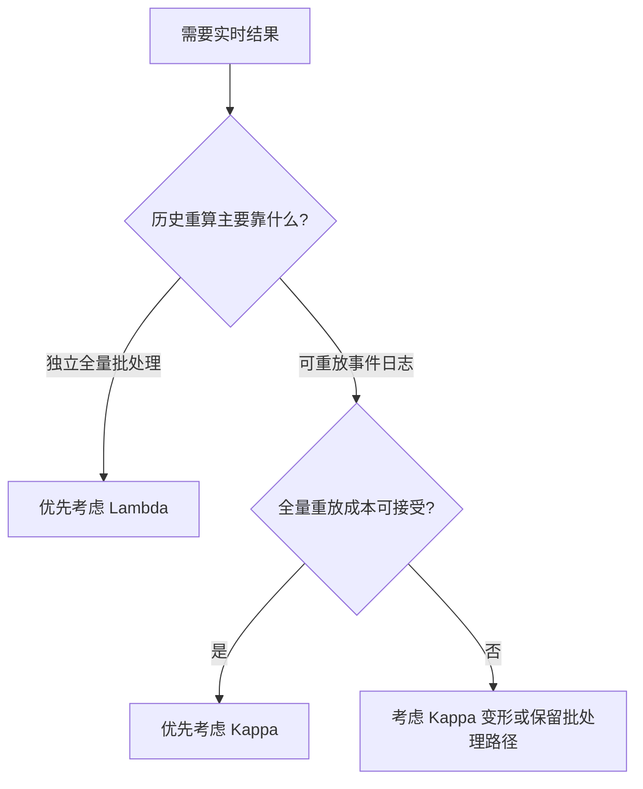

# Lambda 与 Kappa：怎样根据重算和实时需求做选择

> [!info] 承接
> Lambda 和 Kappa 都想同时解决“新数据尽快可见”和“历史结果能够修正”。区别不在于谁更先进，而在于**历史重算到底依赖独立批处理路径，还是依赖事件日志重放。**

> [!summary]- 快速复习卡片（学完再看）
> - **Lambda：** 批 + 流双链路；历史全量重算能力直接，但系统复杂。
> - **Kappa：** 单一流处理主链 + 日志重放；实现统一，但依赖日志可重放且重放成本可接受。
> - **第一动作：** 先问“历史重算靠什么”，再选架构。

## 一张表先分清

| 维度 | Lambda | Kappa |
| --- | --- | --- |
| 计算路径 | 批处理 + 实时处理两条 | 主要是一条流处理链 |
| 最新数据 | 速度层快速处理 | 流处理直接处理 |
| 历史重算 | 批处理层读取全量历史重算 | 从持久日志重新消费事件 |
| 业务逻辑维护 | 批、流可能各维护一套 | 尽量复用同一套流逻辑 |
| 主要优势 | 全量历史重算直观、批处理能力强 | 架构与代码路径更统一 |
| 主要代价 | 双链路开发、运维和一致性复杂 | 日志保存、重放时间与流处理表达能力成为约束 |

## 选择时不要只看“实时”

两者都能做实时处理，所以“需要实时”不是区分它们的充分条件。

真正应该继续问：

### 1. 历史全量计算是不是核心能力？

如果大量任务天然适合离线全量扫描，历史结果经常需要独立批处理重建，Lambda 的批处理层更直接。

### 2. 输入事件能不能可靠长期保存并重放？

如果事件日志天然存在，而且主要业务逻辑都能由流处理表达，Kappa 可以减少两套实现。

### 3. 从头重放历史事件贵不贵？

如果数据量巨大、全量重放需要很久，就要评估 Kappa 变形、快照/分段重算，或者保留批处理能力。

### 4. 团队能否承受双链路复杂度？

Lambda 的问题不只是机器多，而是同一业务含义可能在批、流两套实现中漂移。团队若更看重统一逻辑，Kappa 的吸引力更大。

## 教材选型时重点看哪四类因素

主教材把设计选择归纳为四类主要因素：

1. **业务需求与技术要求**：如果场景天然依赖离线批处理能力，Lambda 更直接；如果主要是流式数据并希望统一流处理逻辑，Kappa 更合适。
2. **系统复杂度**：算法或模型经常变化时，Lambda 可能需要同时修改批、流两套实现；Kappa 一套处理逻辑更容易保持一致。
3. **开发维护成本**：Lambda 要开发、部署、测试和维护两套处理链；Kappa 通常只维护一套主链。
4. **历史数据处理能力**：频繁对超大规模历史数据做全量分析，更偏向 Lambda；历史回放规模可控时，Kappa 更有优势。

教材给出的是一种**特定边界**，不是“凡机器学习都选 Lambda”：如果业务必须先用离线批处理训练出模型，再把这个训练结果交给实时流做验证或预测，而且两段处理不能合并，就应保留 Lambda 的批处理层和流处理层。

可以把它想成两支有先后关系的队伍：批处理先用一批历史样本产出模型版本；模型准备好后，实时流才拿它评估新到的数据。这里要保留两条路径的原因，是实时路径要消费批处理的产物，职责和执行条件不同。**如果题目只说“用了机器学习”或“既有离线数据又有实时数据”，还不足以选 Lambda**；仍要看批流逻辑能否统一、历史是否需要批量重算、事件日志能否重放以及维护成本。

> [!warning]
> “两者都支持实时”不能作为选型依据；教材也没有把“计算开销”作为最主要的设计选择因素。

## 题干决策链

## 最容易混淆的三句话

1. **Lambda 不是“批处理架构”**：它同时有批处理与速度处理。
2. **Kappa 不是“不要历史数据”**：它恰恰依赖可重放历史日志。
3. **Kappa 不是无条件替代 Lambda**：重放成本和离线全量计算需求会改变选择。

## 考前一句话

**要全量批处理重算且能接受双链路复杂度，看 Lambda；事件可重放、希望统一处理逻辑且重放成本可控，看 Kappa。**

返回：[[大数据架构索引]]。
