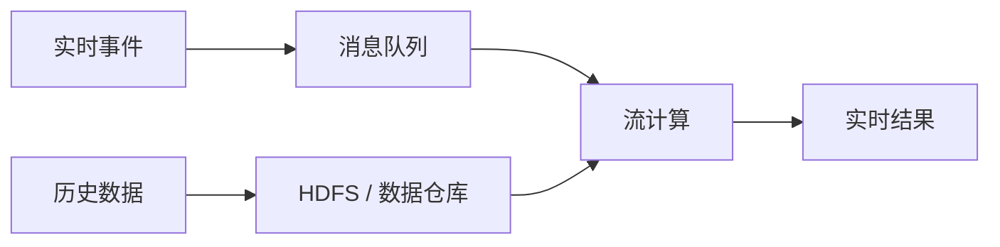
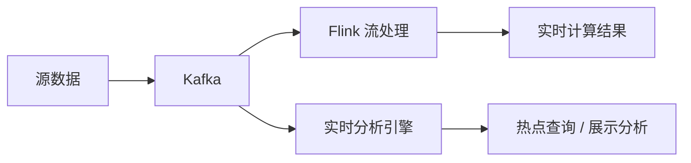

# Kappa 变形：Kappa+ 与混合分析系统分别补什么短板

> [!info] 承接
> [[03_Kappa架构：为什么只保留流处理主链并依靠日志重放]] 已经解决“怎样用一套流处理逻辑替代批/流双代码”。但 Kappa 简化计算链以后仍留下两个工程问题：**历史数据长期放在消息队列里，回溯成本可能很高；结果视图的复杂分析能力也可能不够。**

> [!summary]- 快速复习卡片（学完再看）
> **Kappa+：** 重点补历史数据存储与 backfill，核心是让流计算直接读取 HDFS/数据仓库中的历史数据。
> **混合分析系统：** 重点补结果展示与热点查询分析，在 Kappa 流计算旁增加实时分析引擎。
> **第一动作：** 先看题干是在抱怨“历史日志存不下/回放太贵”，还是“结果不好查/分析能力不足”。
> **易错点：** 两者都是针对 Kappa 短板的变形，不等于重新回到标准 Lambda。

## Kappa 为什么还需要变形

标准 Kappa 的优势是只有一条流处理主链，但教材明确指出它仍有几个短板：

- 消息中间件长期保存大量历史数据，会带来存储压力；
- 一次回溯很长时间范围的数据，会消耗大量实时计算资源；
- 展示层和复杂分析能力不一定足够。

因此后续变形不是否定 Kappa，而是在保留“统一处理逻辑”思想的同时，补它最薄弱的部分。

## Kappa+：重点解决历史数据 backfill 的存储与回算压力

Kappa+ 的核心不是“再加一个批处理层”，而是：

> **让流计算框架可以直接读取 HDFS/数据仓库中的历史数据，进行历史 backfill，而不必为了重算把全部历史日志长期留在消息队列中，或再把数据拷回消息队列。**

可以把它理解成两条数据使用路径：

同一套流计算框架既能消费实时事件，也能在需要历史重算时读取数据仓库中的历史数据。

教材还进一步把任务区分为无状态任务和时间窗口任务。考试不必背实现细节，重点抓住：

- 历史数据放到更适合大规模存储的系统；
- backfill 时直接从历史存储读取；
- 目标是减轻消息队列长期存储与超长回放的压力。

**题干信号：** “不想长期在 Kafka 中保留全部历史日志”“历史回算希望直接读取 HDFS/数据仓库” → Kappa+。

## 混合分析系统：重点解决结果展示和热点分析能力不足

Kappa 流处理可以很快地产生结果，但“算出来”不等于“很方便地做复杂查询和展示”。

教材给出的混合分析思路是：

> **保留 Kafka + Flink 的 Kappa 流处理主链，再接入 Elasticsearch 等实时分析引擎，增强热点数据的索引、查询和分析能力。**

这里的“混合”不是说所有批处理能力都回来了。教材明确指出：实时分析引擎适合合理规模的热点数据，**不能覆盖所有大规模批处理分析需求**。

因此它更像：

> **Kappa 的流处理能力 + 专门的查询分析能力。**

教材把这种方案看作 Kappa 与 Lambda 之间的一种折中。

## 两种变形怎样一眼分清

| 题干问题 | 优先想到 |
| --- | --- |
| 历史日志长期存在消息队列成本太高 | Kappa+ |
| backfill 不想先把历史数据重新灌回消息队列 | Kappa+ |
| 需要直接从 HDFS/数据仓库读取历史数据重算 | Kappa+ |
| 流处理结果不方便做热点查询、索引和展示分析 | 混合分析系统 |
| Kafka + Flink 后又组合 Elasticsearch 做实时分析 | 混合分析系统 |

## 和 Lambda 的边界

Kappa+ 加入 HDFS，不等于“它就是 Lambda”。

判断关键仍然是：

- **Lambda**：明确保留批处理层与速度层两套处理路径；
- **Kappa+**：仍希望用统一的流计算框架处理实时和历史 backfill，只是历史数据改放到更适合的大规模存储中；
- **混合分析系统**：仍以 Kappa 流计算为主，只补查询与分析展示能力。

## 自测

1. 系统不希望在消息队列中保存一年的历史数据，但又需要用同一套流计算逻辑重新计算历史结果，应优先想到什么？

> [!answer]- 第 1 题答案与解析
> **答案**：Kappa+。
> **解析**：它允许流计算直接读取 HDFS/数据仓库中的历史数据进行 backfill，降低消息队列长期存储压力。

2. Kafka + Flink 已完成实时流计算，但业务还要求对热点结果做快速索引和查询分析，教材中的变形思路是什么？

> [!answer]- 第 2 题答案与解析
> **答案**：混合分析系统的 Kappa 架构。
> **解析**：它在 Kappa 流计算基础上组合实时分析引擎，补结果查询和展示分析能力。

## 下一站

知道标准 Kappa 和两种常见变形以后，最后回到架构决策：[[04_Lambda与Kappa：怎样根据重算和实时需求做选择]]。
