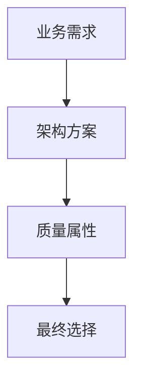

# {{title}}

## 案例背景

用 3-5 句话概括案例场景。

## 问题拆解

| 问题 | 考点 | 解题线索 |
| --- | --- | --- |
|  |  |  |

## 答题框架

### 1. 先判断问题类型

- 架构风格选择
- 质量属性权衡
- 数据库设计
- 安全性设计
- 可靠性设计
- 项目管理/生命周期

### 2. 写出核心判断

> [!important] 核心判断
> 用一句话给出你的结论。

### 3. 展开理由

- 理由一：
- 理由二：
- 理由三：

### 4. 画图辅助

简单图：

````markdown

````

复杂图：使用 Excalidraw，保存到 `05_画图素材/Excalidraw/`。

## 标准答案对照

| 我的要点 | 标准答案要点 | 差距 |
| --- | --- | --- |
|  |  |  |

## 可复用答题句

- 
- 

## 复习记录

| 日期 | 复述是否流畅 | 下次复习 |
| --- | --- | --- |
|  |  |  |
