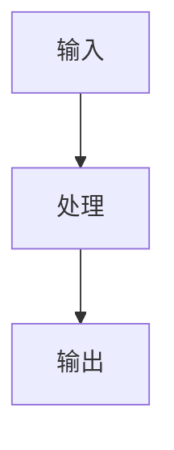

# {{title}}

## 图的用途

| 字段 | 内容 |
| --- | --- |
| 所属章节 |  |
| 对应知识点 |  |
| 图类型 | Mermaid / Excalidraw / Canvas |
| 适用场景 | 综合知识 / 案例 / 论文 |

## Mermaid 图

````markdown

````

## Excalidraw 图

复杂架构图、论文架构图、DFD、UML、部署图建议用 Excalidraw。

保存位置：

```text
05_画图素材/Excalidraw/
```

嵌入方式：

```markdown
![[图名]]
```

## 图中术语解释

| 术语 | 解释 |
| --- | --- |
|  |  |

## 可考问题

- 这张图能回答什么考试题？
- 题干出现什么关键词会用到这张图？
- 这张图能支撑哪个论文论点？

## 复习记录

| 日期 | 是否能复述 | 备注 |
| --- | --- | --- |
|  |  |  |
