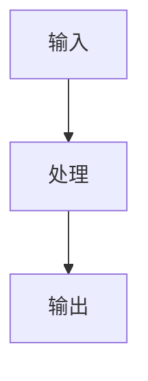

# {{title}}

> [!important] 一句话结论
> 用一句话说明这个知识点考试怎么考、为什么重要。

## 基础信息

| 字段 | 内容 |
| --- | --- |
| 所属章节 |  |
| 知识模块 |  |
| 考试题型 | 综合知识 / 案例分析 / 论文 |
| 重要程度 | 高 / 中 / 低 |
| 掌握状态 | 未学 / 学习中 / 待复习 / 已掌握 |

## 核心定义

用自己的话解释，不要照抄教材。

## 考试怎么认

题干出现这些词时，优先想到它：

- 
- 

## 核心机制

分点解释机制、流程或原理。

## 易混对比

| 对比项 | 本知识点 | 易混知识点 |
| --- | --- | --- |
| 核心目的 |  |  |
| 适用场景 |  |  |
| 优缺点 |  |  |
| 考题关键词 |  |  |

## 记忆口诀

写一个自己能记住的口诀。

## 典型考法

- 上午题：
- 案例题：
- 论文题：

## 图示

简单图用 Mermaid，复杂图用 Excalidraw。

````markdown

````

## 真题/例题

> 题目：
>
> 答案：
>
> 解析：

## 复习记录

| 日期 | 复习结果 | 下次复习 |
| --- | --- | --- |
|  |  |  |
